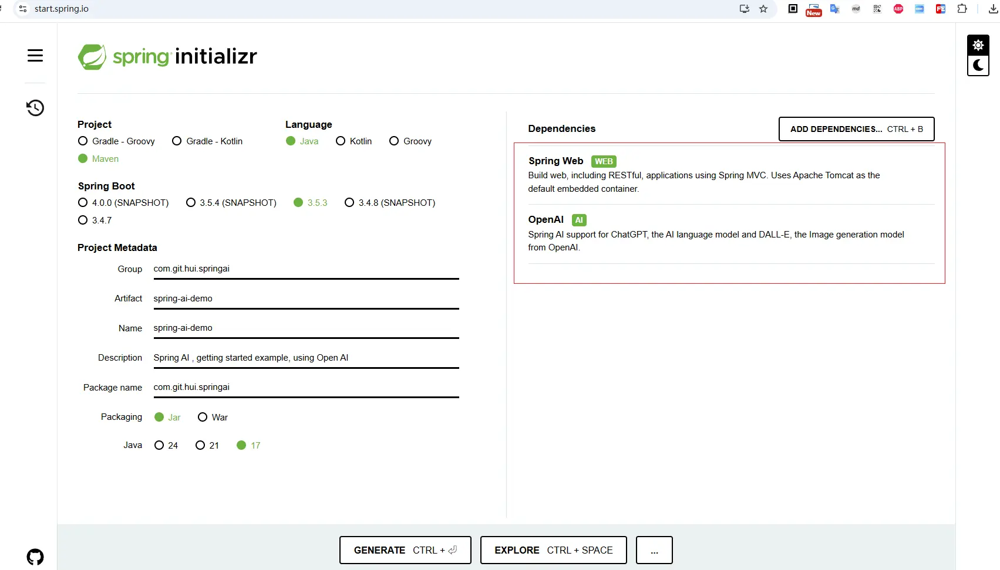
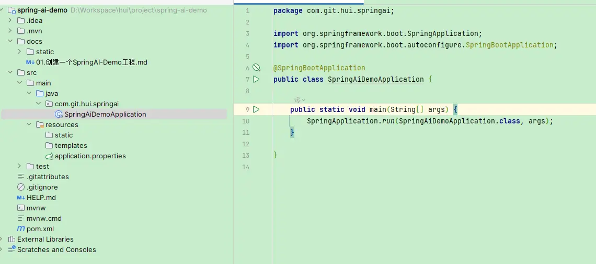
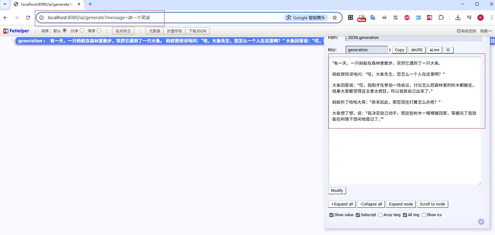

# 01. 创建一个SpringAI的示例工程

下面介绍一下，如何快速借助官方的启动方式进行快速搭建一个用于体验SpringAI的示例工程

## 一、项目创建

> https://spring.io/projects/spring-ai

借助Spring官方提供的快速创建项目功能，创建一个SpringBoot项目，点击下面的连接进入快速创建Spring-Ai项目

- [start.spring.io](https://start.spring.io/#!type=maven-project&language=java&platformVersion=3.3.4&packaging=jar&jvmVersion=17&groupId=spring.ai.example&artifactId=spring-ai-demo&name=spring-ai-demo&description=Spring%20AI%20%2C%20getting%20started%20example%2C%20using%20Open%20AI&packageName=spring.ai.example.spring-ai-demo&dependencies=web,spring-ai-openai)



在表格中，填写关键的信息（Group, Artifact, Name, Description, Version, PackageName）

## 二、项目初始化

将上面生成的工程，解压之后，导入IDEA开发工具，你会得到一个空的Spring项目



### 1. 配置账号信息

上面创建的默认是OpenAI(Chatgpt)的大模型访问，这个需要我们提前备好梯子和密钥，账号充值才能使用，只需要在`applicatin.properties`文件中添加密钥即可

```properties
spring.ai.openai.api-key=<your-openai-api-key>
```

> 出于安全考虑，可以通过配置环境变量的方式来配置密钥，如下

```yaml
# In application.yml
spring:
  ai:
    openai:
      api-key: ${OPENAI_API_KEY}
```

然后设置环境变量

```bash
# In your environment or .env file
export OPENAI_API_KEY=<your-openai-api-key>
```

### 2. 使用免费的智普大模型体验

当然若条件不允许，我们可以考虑智普清言的免费大模型

替换依赖

```xml
<!-- 移除下面的依赖 -->
<dependency>
    <groupId>org.springframework.ai</groupId>
    <artifactId>spring-ai-starter-model-openai</artifactId>
</dependency>

<!-- 替换为智普的依赖 -->
<dependency>
    <groupId>org.springframework.ai</groupId>
    <artifactId>spring-ai-starter-model-zhipuai</artifactId>
</dependency>
```

在智普的开放平台获取密钥：[https://open.bigmodel.cn/usercenter/proj-mgmt/apikeys](https://open.bigmodel.cn/usercenter/proj-mgmt/apikeys)


然后在配置文件中，添加智普的密钥，并指定免费的大模型

> 在官网的定价中可以找到免费的模型：[https://www.bigmodel.cn/pricing](https://www.bigmodel.cn/pricing) 

```yaml
spring:
  ai:
    zhipuai:
      api-key: ${zhipuai-api-key}
      chat:
        options:
          model: GLM-4-Flash
```

### 3. 密钥注入方式

密钥除了直接再配置文件中写死之外，也可以通过前面介绍的环境变量的方式来注入，除此之外，下面介绍一种本地开发时命令行参数注入的方式

为了避免`api-key`的泄露，我们借助SpEL的方式来注入，通过在启动时，添加参数来设置apiKey，如下

- 唤起编辑启动命令行窗口
- 点击`Modify options`
- 在弹窗中选中 `Program arguments`，然后会看到再启动类右边新增一个输入框
- 再输入框中添加`--spring.ai.zhipuai.api-key=<your-zhipuai-api-key>`


**说明：为什么不建议直接在配置文件中写密钥？**

- 因为非常容易泄露，本地测试时，最简单的当然是直接在配置文件中写密钥，但是当我们将项目推送到git时，很容易忘了将密钥删除，这样，密钥就泄露了（即便你后续发现了再删除，但是git的历史提交中依然能找到你的密钥，你就只能删除它了）

## 三、项目运行

再上面初始化完成之后，接下来我们写一个简单的Chat服务，用于体验与大模型对话的感觉

新建一个ChatController类，用于接收用户的提问，并返回模型生成的答案

```java
@RestController
public class ChatController {

    private final ZhiPuAiChatModel chatModel;

    @Autowired
    public ChatController(ZhiPuAiChatModel chatModel) {
        this.chatModel = chatModel;
    }

    @GetMapping("/ai/generate")
    public Map generate(@RequestParam(value = "message", defaultValue = "Tell me a joke") String message) {
        return Map.of("generation", chatModel.call(message));
    }

    @GetMapping("/ai/generateStream")
    public Flux<ChatResponse> generateStream(@RequestParam(value = "message", defaultValue = "Tell me a joke") String message) {
        var prompt = new Prompt(new UserMessage(message));
        return chatModel.stream(prompt);
    }
}
```

上面分别提供同步/流式调用大模型两种方式，测试时，你可以选择任意一种方式




## 四、小结

从本文搭建的一个示例工程可以看出，借助SpringAI与大模型进行交互可以说是非常简单了，比基于db的CURD效率要高多了。相比起我们自己的实现（比如技术派的大模型调用就是手撸的代码直接实现与大模型交互），实在是轻松太多

文中所有代码可以在[https://github.com/liuyueyi/spring-ai-demo](https://github.com/liuyueyi/spring-ai-demo/tree/master/S01-chat-demo) 获取

