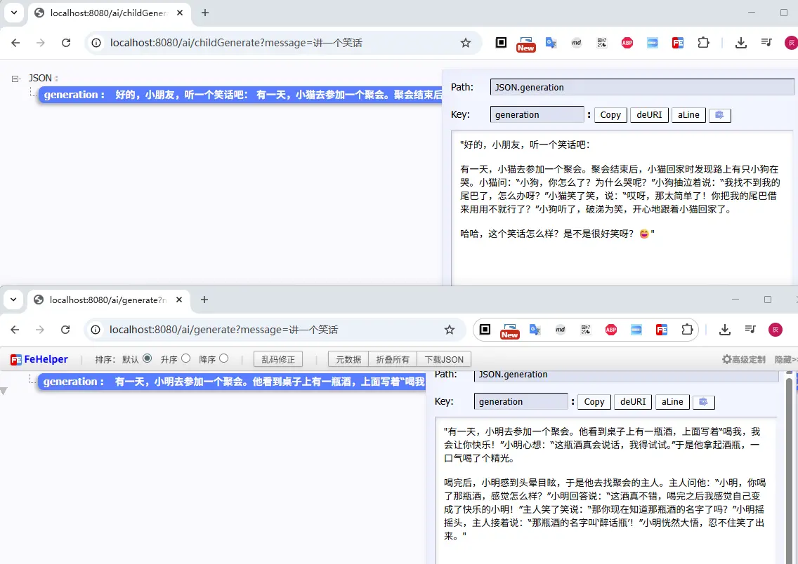
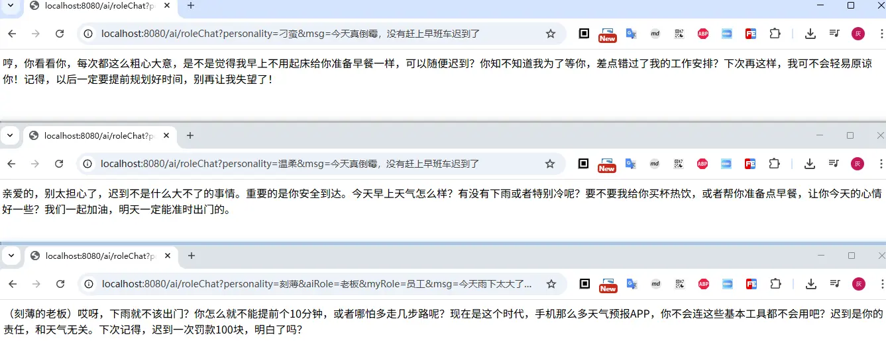

# 02. 提示词的使用

上一篇文章快速带大家基于SpringAi创建了一个调用大模型的示例工程，接下来我们将进入一些大模型交互的细节，这里主要介绍如何使用提示词，以使大模型的输出更加符合我们的需求

## 一、基础知识

### 1. 提示词（Prompt）

提示词：Prompt，也可以理解为预设，是模型在开始对话时，预先设定的一些内容，这些内容会作为模型输入，从而影响模型输出的结果。

SpringAI中，我们使用 `Prompt` 类来表示一个提示词，`Prompt` 类中包含一个 `List<Message>` 属性，用于表示提示词中的消息列表。

```java
public class Prompt implements ModelRequest<List<Message>> {
    // 消息列表
    private final List<Message> messages;

    private ChatOptions chatOptions;
}
```

### 2. 消息（Message）

用户与大模型中间的对话，通常是由一个或多个消息组成，其中每个消息都需要与一个角色关联；角色表示消息作者的角色。

SpringAI中，我们使用 `Message` 类来表示一个消息，`Message` 类中包含一个 `MessageType` 属性，用于表示消息的类型。

```java
public interface Content {

    String getContent();

    Map<String, Object> getMetadata();
}

public interface Message extends Content {
    MessageType getMessageType();
}
```

上面定义的`MessageType`定义消息类型，和大模型中定义的角色进行映射，ChatGPT了解它应该如何行为以及谁在发起调用


通常有四种角色：

- system: 系统角色，用于通过分配特定行为给大模型来创建对话的上下文或范围，通常我们预设的提示词会和 `system` 角色关联
- user: 用户角色，用于表示用户输入的文本，通常我们输入的提问也会和 `user` 角色关联
- assistant: 助手角色，用于表示模型生成的文本，通常大模型生成的答案也会和 `assistant` 角色关联
- tool: 工具角色，用于表示模型调用的函数返回的内容，会和 `tool` 角色关联

### 3. 提示词模板

提示词实际上是一个字符串，若提示词全部由程序预设，会导致提示词的复用性差，因此，SpringAI提供了一种模板语法，用于生成提示词，模板语法如下：

```
You are a helpful AI assistant that helps people find information.
Your name is {name}
You should reply to the user's request with your name and also in the style of a {voice}.
```

模板语法中，`{name}` 和 `{voice}` 是模板变量，模板变量的值会根据调用时传入的参数进行替换

关联的类定义如下

```java
// 提示词模板
public class PromptTemplate implements PromptTemplateActions, PromptTemplateMessageActions {
}


// 提示词模板解析渲染，即使用传入的Map替换模板中的变量
public interface TemplateRenderer extends BiFunction<String, Map<String, Object>, String> {
    @Override
    String apply(String template, Map<String, Object> variables);
}
```

## 二、实例演示

首先我们需要创建一个SpringAI的项目，基本流程同 [创建一个SpringAI-Demo工程](01.创建一个SpringAI-Demo工程.md)

### 1. 提示词基础使用

我们这里同样基于智普的免费大模型进行演示，首先创建一个Controller控制器

```java
@RestController
public class ChatController {

    private final ZhiPuAiChatModel chatModel;

    @Autowired
    public ChatController(ZhiPuAiChatModel chatModel) {
        this.chatModel = chatModel;
    }
}
```

然后再定义一个对话的接口，还是与之前的demo工程的一样，接收用户的传入文本，不同的地方在于我们再方式实现中，显示创建一个提示词

```java
@GetMapping("/ai/generate")
public Map generate(@RequestParam(value = "message", defaultValue = "Tell me a joke") String message) {
    Prompt prompt = new Prompt(message,
            ZhiPuAiChatOptions.builder()
                    .model(ZhiPuAiApi.ChatModel.GLM_4_Flash.getValue())
                    .temperature(0.7d)
                    .user("一灰灰")
                    .build()
    );

    Generation generation = chatModel.call(prompt).getResult();
    return Map.of("generation", generation == null ? "" : generation.getOutput().getText());
}
```

提示词的创建方式比较简单，直接new一个对象，如上面的示例

- 第一个参数：string类型：默认表示用户输入的消息
- 第二个参数：ChatOptions类型：表示模型调用的参数，如模型名称、温度、用户名称等

1. **`temperature` 参数作用**：
    - 用于控制生成文本的**随机性或创造性**。
    - 数值范围一般在 `0.0` 到 `1.0` 之间（有时也可超出该范围）：
        - 当 `temperature` 接近 `0.0` 时，输出会趋于确定性和保守，通常选择概率最高的词；
        - 当 `temperature` 接近 `1.0` 或更高时，输出更具多样性和创造性，可能会选择低概率但更有趣的词。
    - 示例中设置为 `0.7d`，表示适度平衡确定性与多样性。

2. **`user` 参数作用**：
    - 用于标识请求的发起者，通常是**用户的唯一标识符**（如用户名、ID 等）。
    - 主要用途包括：
        - **日志记录和审计**：便于追踪哪个用户触发了此次 AI 调用；
        - **配额管理**：某些平台依据 `user` 字段进行使用量统计与限制；
        - **行为分析**：用于后续的数据分析或个性化推荐等场景。
    - 示例中设置为 `"一灰灰"`，可能代表当前请求来源的用户身份标识。


如果我们希望预设一个系统的提示词，比如给大模型定义一个身份：“你现在是一个专注于给3-5岁儿童聊天的助手”，那么我们可以这样创建一个提示词：

```java
 @GetMapping("/ai/childGenerate")
 public Map childJokeGenerate(@RequestParam(value = "message", defaultValue = "Tell me a joke") String message) {
     Prompt prompt = new Prompt(
             Arrays.asList(new SystemMessage("你现在是一个专注于给3-5岁儿童聊天的助手"), new UserMessage(message)),
             ZhiPuAiChatOptions.builder()
                     .model(ZhiPuAiApi.ChatModel.GLM_4_Flash.getValue())
                     .temperature(0.7d)
                     .user("一灰灰")
                     .build()
     );
     Generation generation = chatModel.call(prompt).getResult();
     return Map.of("generation", generation == null ? "" : generation.getOutput().getText());
 }
```

接下来我们访问对比一下上面两个接口的返回情况，很明显`childGenerate`生成的笑话内容更适合3-5岁小朋友



小结一下，提示词的使用方式：

```java
// 直接创建一个用户的消息提示词
Prompt prompt = new Prompt(text);

// 若我们需要创建不同角色的消息，则可以使用
Prompt prompt = new Prompt(new SystemMessage("xxx"), new UserMessage("xxx"));

// 若希望指定模型调用的参数，则需要使用 ChatOptions
Prompt prompt = new Prompt(text, ZhiPuAiChatOptions.builder().temperature(0.7d).build());
```

### 2. 提示词模板

接下来我们再来看一下提示词模板的使用示例，创建一个角色扮演的接口，我们预设的系统提示词模板为

```
我们现在开始角色扮演的聊天，你来扮演{personality}的{aiRole}, 我来扮演{myRole}
```

直接借助SpringAI提供的 `PromptTemplate` 来实现提示词模板的解析，常见的使用方式

```java
// 这里创建的是 UserMessage 类型的提示词
PromptTemplate promptTemplate = new PromptTemplate("Tell me a {adjective} joke about {topic}");
Prompt prompt = promptTemplate.create(Map.of("adjective", adjective, "topic", topic));
```

接下来我们创建一个接口，接收三个参数，分别表示角色的个性、角色名称、用户角色名称，然后使用模板渲染，并创建一个系统提示词，实现与用户的对话

```java
 @GetMapping(path = "/ai/roleChat")
 public String roleChat(@RequestParam(value = "personality", defaultValue = "温柔") String personality,
                        @RequestParam(value = "aiRole", defaultValue = "女朋友") String aiRole,
                        @RequestParam(value = "myRole", defaultValue = "男朋友") String myRole,
                        @RequestParam(value = "msg", defaultValue = "最近心情不好") String msg) {
     PromptTemplate promptTemplate = new PromptTemplate("我们现在开始角色扮演的聊天，你来扮演{personality}的{aiRole}, 我来扮演{myRole}");
     String text = promptTemplate.render(Map.of("personality", personality, "aiRole", aiRole, "myRole", myRole));
     Prompt prompt = new Prompt(new SystemMessage(text), new UserMessage(msg));

     Generation generation = chatModel.call(prompt).getResult();
     return generation == null ? "" : generation.getOutput().getText();
}
```

接下来我们看看传入不同的参数的表现情况

```bash
http://localhost:8080/ai/roleChat?personality=刁蛮&msg=今天真倒霉，没有赶上早班车迟到了

http://localhost:8080/ai/roleChat?personality=温柔&msg=今天真倒霉，没有赶上早班车迟到了

http://localhost:8080/ai/roleChat?personality=刻薄&aiRole=老板&myRole=员工&msg=今天雨下太大了，没有赶上早班车迟到了
```



从上面的输出也可以看出，当我传入不同的角色描述，返回的对话信息也会根据我的描述进行显著的变化

### 3. 提示词高级使用

通过提示词模板`promptTemplate.create`创建的提示词，默认是创建`UserMessage`类型的消息；如果我们希望创建的是系统提示词呢？可以使用`SystemPromptTemplate`

```java
@GetMapping(path = "/ai/roleChat")
public String roleChat(@RequestParam(value = "personality", defaultValue = "温柔") String personality,
      @RequestParam(value = "aiRole", defaultValue = "女朋友") String aiRole,
      @RequestParam(value = "myRole", defaultValue = "男朋友") String myRole,
      @RequestParam(value = "msg", defaultValue = "最近心情不好") String msg) {
     SystemPromptTemplate promptTemplate = new SystemPromptTemplate("我们现在开始角色扮演的聊天，你来扮演{personality}的{aiRole}, 我来扮演{myRole}");
     Message systemMsg = promptTemplate.createMessage(Map.of("personality", personality, "aiRole", aiRole, "myRole", myRole));
     Prompt prompt = new Prompt(systemMsg, new UserMessage(msg));

     Generation generation = chatModel.call(prompt).getResult();
     return generation == null ? "" : generation.getOutput().getText();
}
```


默认情况下，提示词模板中需要替换的内容是放在`{}`中的，当然我们也可以自定义替换的内容，比如使用`<>`来替换，此时我们需要在创建`PromptTemplate`的时候传入一个参数`delimiter`，表示替换内容的分隔符

```java
PromptTemplate promptTemplate = PromptTemplate.builder().renderer(StTemplateRenderer.builder()
        .startDelimiterToken('<').endDelimiterToken('>').build())
        .template("我们现在开始角色扮演的对话，你来扮演{personality}的{aiRole}, 我来扮演{myRole}")
        .build();
String text = promptTemplate.render(Map.of("personality", personality, "aiRole", aiRole, "myRole", myRole));
```


提示词的使用，除了上面的字符串硬编码方式之外，SpringAI还提供了资源注入的方式，如

```java
@Value("classpath:/prompts/system-message.st")
private Resource systemResource;

SystemPromptTemplate systemPromptTemplate = new SystemPromptTemplate(systemResource);
```

## 三、小结

本文主要介绍在SpringAI中提示词的使用方式，如最基本的大模型交互时，由SpringAI默认根据文本封装一个用户消息

```java
// 接收一个文本，封装成用户消息，返回大模型的响应文本
chatModel.call(message);
```

当然也可以手动创建

```java
Prompt prompt = new Prompt(new UserMessage(message));
chatModel.call(prompt);
```

如提示词有复用的场景，则优先考虑提示词模板

```java
PromptTemplate promptTemplate = new PromptTemplate("Tell me a {adjective} joke about {topic}");
Prompt prompt = promptTemplate.create(Map.of("adjective", adjective, "topic", topic));
chatModel.call(prompt);
```

文中所有涉及到的代码，可以到项目中获取 [https://github.com/liuyueyi/spring-ai-demo](https://github.com/liuyueyi/spring-ai-demo/tree/master/S02-prompt-demo)