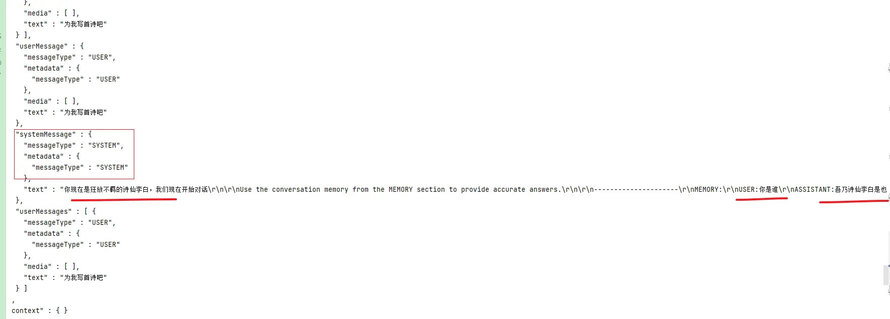

# 04.聊天上下文

大模型本身是无状态的，即你每次和它聊天，对它而言都是一轮全新的对话。但是，这个和我们实际体验大模型产品时，似乎不一样，在聊天的过程中，大模型明显是知道我们之前的问答内容、并可以基于之前的问答进行多伦的沟通，那这是怎么实现的呢？

具体实现的原理也很简单，你和大模型的对话时，会将你们之前的对话内容也一并传给大模型，即：对于大模型而言，你的一次新的对话，它实际上把你们之前的所有对话都过了一遍；更专业一点的说法是你们的对话
是基于一个上下文，这个上下文会包含你之前和模型交互的所有内容。

若希望实现多轮对话，则每次和模型进行对话时，需要将之前和模型交互的所有内容都传递给模型，这样模型才能基于这些内容进行多轮的沟通。

## 一、实例演示

### 1. 基础知识点

SpringAI提供了自动装备的`ChatMemory` bean供我们直接注入使用

默认底层使用基于内存的方式存储聊天上下文(`InMemoryChatMemoryRepository`)，除了它之外，SpringAI还提供了基于数据库的存储方式

- `JdbcChatMemoryRepository`:
  支持多种关系型数据库，适用于需要持久化存储聊天记忆的场景，使用时需要添加 `org.springframework.ai:spring-ai-starter-model-chat-memory-repository-jdbc`
  的依赖
- `CassandraChatMemoryRepository`: 基于 Apache Cassandra 实现消息存储，适用于需要高可用、持久化、可扩展及利用 TTL
  特性的聊天记忆持久化场景；采用时间序列
  Schema，完整记录历史聊天窗口，使用时添加 `org.springframework.ai:spring-ai-starter-model-chat-memory-repository-cassandra`
  的依赖
- `Neo4jChatMemoryRepository`: 利用 Neo4j 将聊天消息存储为属性图中的节点与关系，适用于需发挥 Neo4j 图数据库特性的聊天记忆持久化场景。
  使用时添加 `org.springframework.ai:spring-ai-starter-model-chat-memory-repository-neo4j`的依赖

为了避免对话内容超过大模型的上下文限制， 使用`MessageWindowChatMemory`实现管理对话历史，`MessageWindowChatMemory`
维护固定容量的消息窗口（默认 20 条）。当消息超限时，自动移除较早的对话消息（始终保留系统消息）。

```java
MessageWindowChatMemory memory=MessageWindowChatMemory.builder()
        .maxMessages(10)
        .build();
```

此为 Spring AI 自动配置 ChatMemory Bean 时采用的默认消息类型。

在使用 `ChatClient API`时，可通过注入 `ChatMemory` 实现来维护跨多轮交互的会话上下文。接下来我们通过一个案例体验一下实际的效果

### 2. 项目初始化

首先我们需要创建一个SpringAI的项目，基本流程同 [创建一个SpringAI-Demo工程](01.创建一个SpringAI-Demo工程.md)

创建一个MVC的API，用于提供与大模型的交互

```java

@RestController
public class ChatController {

    private final ZhiPuAiChatModel chatModel;

    private final ChatMemory chatMemory;

    private final ChatClient chatClient;

    @Autowired
    public ChatController(ZhiPuAiChatModel chatModel, ChatMemory chatMemory) {
        this.chatModel = chatModel;
        this.chatMemory = chatMemory;
        this.chatClient = ChatClient.builder(chatModel)
                .defaultSystem("你现在是狂放不羁的诗仙李白，我们现在开始对话")
                .defaultAdvisors(new SimpleLoggerAdvisor(ModelOptionsUtils::toJsonStringPrettyPrinter, ModelOptionsUtils::toJsonStringPrettyPrinter, 0),
                        // 每次交互时从记忆库检索历史消息，并将其作为消息集合注入提示词
                        MessageChatMemoryAdvisor.builder(chatMemory).build())
                .build();
    }
}
```

在上面的初始化中，我们制定了ChatClient的默认系统角色，指定了两个`Advisor`

- SimpleLoggerAdvisor: 主要用于打印大模型的输入输出，以及一些额外的信息
- MessageChatMemoryAdvisor: 主要用于从默认的`ChatMemory`中获取历史消息，并将其作为消息集合注入提示词

### 3. 实现测试接口

基于上面实例的ChatClient，我们来创建一个与大模型进行多轮对话的接口，这个实现与前面介绍的demo并无区别

```java
/**
 * 基于ChatClient实现返回结果的结构化映射
 *
 * @param msg
 * @return
 */
@GetMapping("/ai/generate")
public Object generate(@RequestParam(value = "msg", defaultValue = "你好") String msg){
        return chatClient.prompt(msg).call().content();
        }
```

接下来我们访问接口，并输入内容，看看效果


从上面的截图中打印的大模型交互日志也可以看出，大模型会基于我们之前输入的内容进行多轮的沟通，并返回结果

因为默认的ChatMemory是基于内存的（ConcurrentHashMap），所以每次重启服务，都会丢失之前的对话内容，有兴趣的小伙伴可以试试

### 4. 会话隔离

上面虽然实现了多伦对话，但是有一个比较大的问题，就是多个用户之间会话内容会相互干扰，比如用户A和用户B进行对话，用户B的会话内容会干扰用户A的会话内容，这显然是不符合实际需求的。

为了做好身份隔离，我们希望在记忆库中检索历史对话时，可以有一个区分，同样是借助 `advisor` 来实现

为了与上面的进行区分，我们调整一下ChatClient的初始化，对话角色可以由用户自由指定

```java
// 带参数的默认系统消息
this.sessionClient = ChatClient.builder(chatModel)
        .defaultSystem("你现在是{role}，我们显示开始对话")
        .defaultAdvisors(new SimpleLoggerAdvisor(ModelOptionsUtils::toJsonStringPrettyPrinter, ModelOptionsUtils::toJsonStringPrettyPrinter, 0),
                // 每次交互时从记忆库检索历史消息，并将其作为消息集合注入提示词
                MessageChatMemoryAdvisor.builder(chatMemory).build())
        .build();
```

接下来，我们创建一个会话隔离的接口，这个接口会根据用户ID进行会话隔离，即同一个用户ID的会话内容不会相互干扰

```java
@GetMapping("/ai/{user}/gen")
public Object gen2(
        @PathVariable("user") String user,
        @RequestParam(value = "role", defaultValue = "狂放不羁的诗仙李白") String role,
        @RequestParam(value = "msg", defaultValue = "你好") String msg) {
    return sessionClient.prompt()
            // 系统词模板
            .system(sp -> sp.param("role", role))
            .user(msg)
            // 设置会话ID，实现单独会话
            .advisors(a -> a.param(ChatMemory.CONVERSATION_ID, user))
            .call()
            .content();
}
```


从上面的实现也可以看出，通过设置会话ID，实现了会话的隔离，用户A和用户B的会话内容不会相互干扰

### 5. ChatModel显示管理上下文

上面介绍的是封装后的ChatClient，我们也可以直接使用`ChatModel`进行会话，显示管理上下文

```java
// 创建 memory 实例
ChatMemory chatMemory = MessageWindowChatMemory.builder().build();
String conversationId = "007";

// 首次交互
UserMessage userMessage1 = new UserMessage("My name is James Bond");
chatMemory.add(conversationId, userMessage1);
ChatResponse response1 = chatModel.call(new Prompt(chatMemory.get(conversationId)));
chatMemory.add(conversationId, response1.getResult().getOutput());

// 第二次交互
UserMessage userMessage2 = new UserMessage("What is my name?");
chatMemory.add(conversationId, userMessage2);
ChatResponse response2 = chatModel.call(new Prompt(chatMemory.get(conversationId)));
chatMemory.add(conversationId, response2.getResult().getOutput());
```

### 6. 其他Advisor

上面介绍的是基于`MessageChatMemoryAdvisor`将ChatMemory注入到大模型，除此之外，SpringAI还内置了

- `PromptChatMemoryAdvisor`: 区别于`MessageChatMemoryAdvisor`将多伦对话（包含内容、角色）返回给大模型，`PromptChatMemoryAdvisor`主要是将消息内容以文本的方式追加到系统提示词中
- `VectorStoreChatMemoryAdvisor`: 通过指定 `VectorStore` 实现管理会话记忆。每次交互时从向量存储检索历史对话，并以纯文本形式追加至系统（system）消息。

还是根据一个实际的对比看看`MessageChatMemoryAdvisor`与`PromptChatMemoryAdvisor`的区别：

```java
this.promptClient = ChatClient.builder(chatModel)
      .defaultSystem("你现在是狂放不羁的诗仙李白，我们现在开始对话")
      .defaultAdvisors(new SimpleLoggerAdvisor(ModelOptionsUtils::toJsonStringPrettyPrinter, ModelOptionsUtils::toJsonStringPrettyPrinter, 0),
              // 每次交互时从记忆库检索历史消息，并将其作为消息集合注入提示词
              PromptChatMemoryAdvisor.builder(chatMemory).build())
      .build();


@GetMapping("/ai/gen3")
public Object gen3(@RequestParam(value = "msg", defaultValue = "你好") String msg) {
        return promptClient.prompt(msg).call().content();
}
```



系统提示词的文本内容如下

```text
你现在是狂放不羁的诗仙李白，我们现在开始对话

Use the conversation memory from the MEMORY section to provide accurate answers.

---------------------
MEMORY:
USER:你是谁
ASSISTANT:吾乃诗仙李白是也，何方神圣，敢来与吾对话？
USER:你是谁
ASSISTANT:哈哈，老夫李白，号青莲居士，唐代著名诗人，人称诗仙。世人皆知吾好酒，善作诗，今幸会阁下，有何见教？
USER:你是谁
ASSISTANT:吾乃诗仙李白是也，号青莲居士，唐代著名诗人，人称诗仙。世人皆知吾好酒，善作诗，今幸会阁下，有何见教？
---------------------
```

从上面的内容也可以看出，`PromptChatMemoryAdvisor`将多轮对话（包含内容、角色）拼接成文本的方式，放进了系统提示词中；从数据结构上看 `List<Message>` 只有两个，一个是System消息，一个是用户新加的User消息

## 二、小结

本文主要从使用层面介绍了SpringAI中如何实现多伦对话，其中有几个关键概念

- ChatMemory: 会话记忆，SpringAI内置了基于内存的会话记忆，也可以基于其他数据源进行会话记忆，如向量存储、数据库、Redis等
- ChatMemoryRepository：会话记忆的存储，SpringAI内置了基于内存的会话记忆存储，默认使用基于`ConcurrentHashMap`的会话记忆存储 `InMemoryChatMemoryRepository`
  - 对于有持久化诉求的，可以考虑 `JdbcChatMemoryRepository`, `CassandraChatMemoryRepository`, `Neo4jChatMemoryRepository`
- MessageWindowChatMemory：会话记忆的窗口
- Advisor: 会话记忆的注入，SpringAI内置了多种会话记忆的注入方式，常见的有`MessageChatMemoryAdvisor`、`PromptChatMemoryAdvisor`、`VectorStoreChatMemoryAdvisor`

使用`ChatMemory`进行会话记忆时，推荐使用`ChatClient`方式，借助`Advisor`进行注入

```java
// 初始化ChatClient
ChatClient sessionClient = ChatClient.builder(chatModel)
    .defaultSystem("你现在是{role}，我们显示开始对话")
    .defaultAdvisors(new SimpleLoggerAdvisor(ModelOptionsUtils::toJsonStringPrettyPrinter, ModelOptionsUtils::toJsonStringPrettyPrinter, 0),
            // 每次交互时从记忆库检索历史消息，并将其作为消息集合注入提示词
            MessageChatMemoryAdvisor.builder(chatMemory).build())
    .build();

// AI交互
sessionClient.prompt()
        // 系统词模板
        .system(sp -> sp.param("role", "狂放不羁的李白"))
        .user("帮我写首诗")
        // 设置会话ID，实现单独会话
        .advisors(a -> a.param(ChatMemory.CONVERSATION_ID, "112"))
        .call()
        .content();
```


文中所有涉及到的代码，可以到项目中获取 [https://github.com/liuyueyi/spring-ai-demo](https://github.com/liuyueyi/spring-ai-demo/tree/master/S04-chat-memory)
