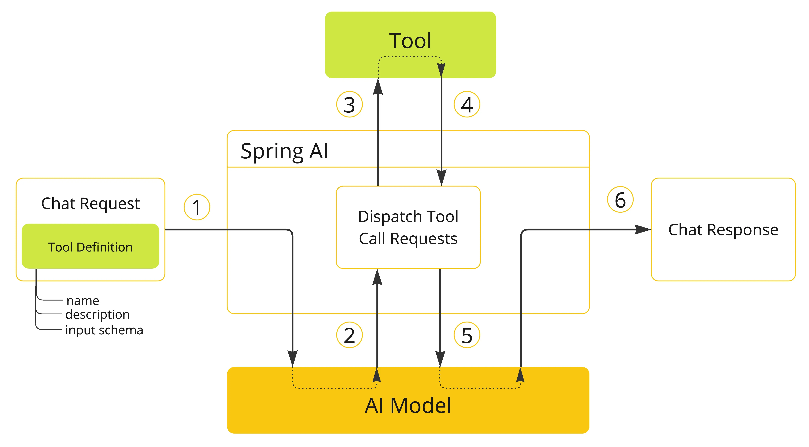
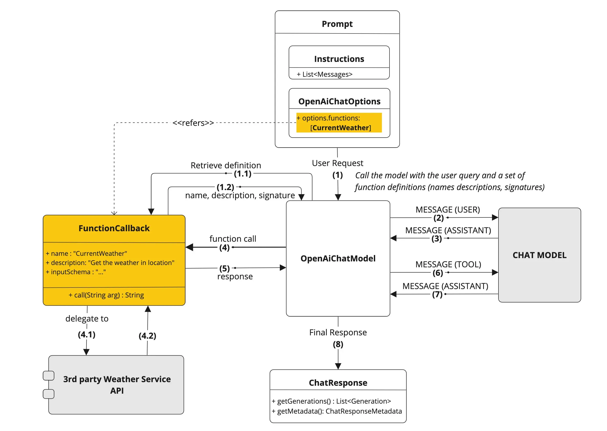
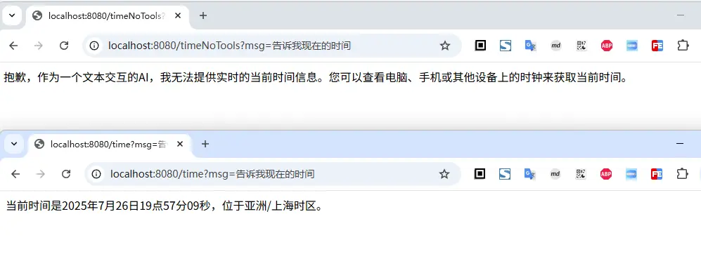
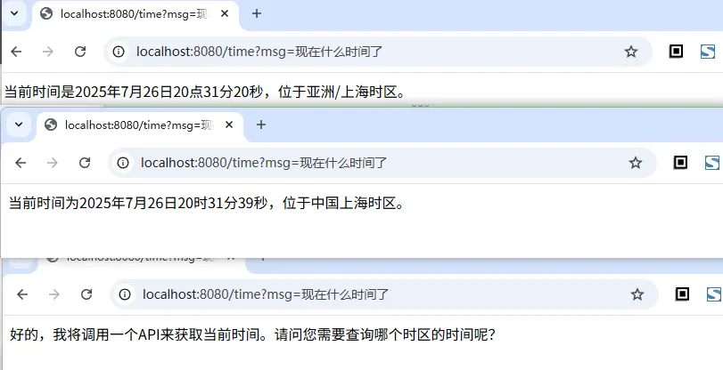
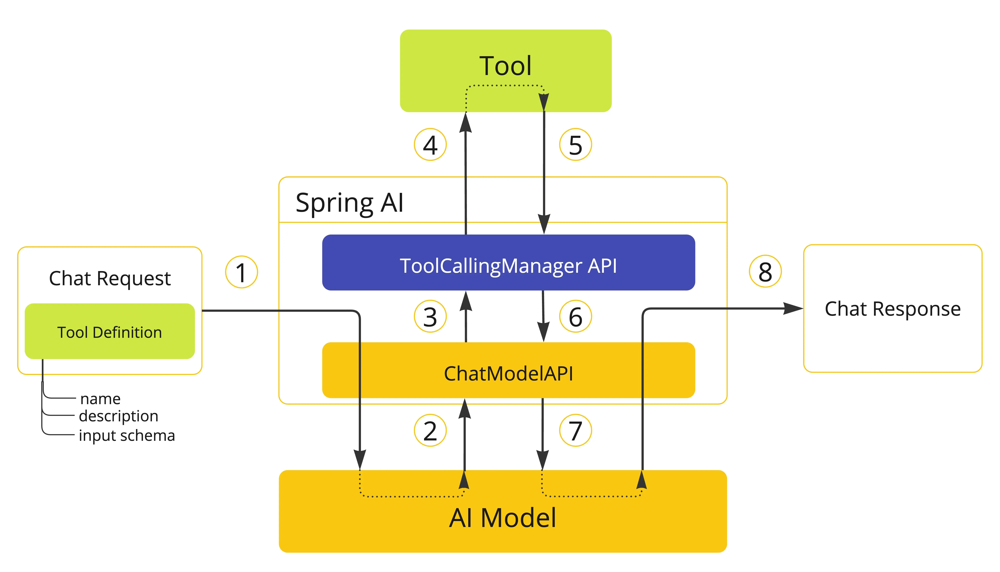

# 06.工具调用FunctionTools

我们知道大模型是基于一系列数据进行训练的，且每次训练的成本很高；那么大模型是怎么样表现得十八般武艺样样精通的呢？

function tools就是设计出来给大模型当外挂的瑞士工具包，通过给大模型设计一个与外部工具进行交互的方式，来扩展大模型在训练时缺失或者不够与时俱进的能力

## 一、工作原理

SpringAi 提供了完备工具调用封装，可以非常方便的将本地方法封装成工具，供大模型调用

### 1. 工具调用流程



工具调用流程如下：

1. 在向大模型发起请求时，将工具信息传递给大模型
   - 每个工具的定义都包含名称、描述、输入参数
2. 大模型根据工具信息，会发送包含工具名称、亲求参数的请求给工具服务
3. 应用程序根据工具名称，识别到对应的工具，调用工具方法
4. 工具执行结果返回给应用程序进行处理（可能是直接返回给用户，也可能是返回给大模型）
5. 应用程序将工具执行结果返回给大模型
6. 大模型利用工具返回的结果，构建返回结果给用户

### 2. SpringAI关键实现

SpringAI主要提供了两种内置方式将本地方法封装成工具

- 声明式：通过注解 `@Tool`
- 编程式：通过底层的 `MethodToolCallback` `FunctionToolCallback`



上图中橙色的部分，就是SpringAI将我们本地方法封装成工具，供大模型进行交互；接下来我们看一下SpringAI的关键类

#### a. ToolCallback

ToolCallback 接口提供了定义 AI 模型可调用工具的方式，包含工具定义和执行逻辑。

```java
public interface ToolCallback {
    ToolDefinition getToolDefinition();

    default ToolMetadata getToolMetadata() {
        return ToolMetadata.builder().build();
    }

    String call(String toolInput);

    default String call(String toolInput, @Nullable ToolContext tooContext) {
        if (tooContext != null && !tooContext.getContext().isEmpty()) {
            throw new UnsupportedOperationException("Tool context is not supported!");
        } else {
            return this.call(toolInput);
        }
    }
}
```

SpringAI提供了两种内置实现

- MethodToolCallback: 将本地方法定义为AI模型可调用的工具
- FunctionToolCallback: 将函数定义为AI模型可调用的工具

#### b. ToolDefinition

ToolDefinition 接口提供 AI 模型识别工具可用性所需的信息，包括工具名称、描述及输入模式。每个 ToolCallback 实现必须提供 ToolDefinition 实例来定义工具。

```java
public interface ToolDefinition {

	/**
	 * 工具名
	 */
	String name();

	/**
	 * 工具说明，告诉AI这个工具可以干嘛
	 */
	String description();

	/**
	 * 传参方式，通常是 json schema格式
	 */
	String inputSchema();
}
```

若需要手动创建的工具定义，可以使用`ToolDefinition.Builder`

```java
ToolDefinition toolDefinition = ToolDefinition.builder()
    .name("currentWeather")
    .description("Get the weather in location")
    .inputSchema("""
        {
            "type": "object",
            "properties": {
                "location": {
                    "type": "string"
                },
                "unit": {
                    "type": "string",
                    "enum": ["C", "F"]
                }
            },
            "required": ["location", "unit"]
        }
    """)
    .build();
```

除了上面的方式，对于本地java方法，可以直接通过反射的方式来生成基于方法的工具定义

```java
Method method = ReflectionUtils.findMethod(DateTimeTools.class, "getCurrentDateTime");
ToolDefinition toolDefinition = ToolDefinition.from(method);

// 如果需要显示修改某些属性，可以如下
ToolDefinition toolDefinition = ToolDefinition.builder(method)
     .name("currentDateTime")
     .description("Get the current date and time in the user's timezone")
     .inputSchema(JsonSchemaGenerator.generateForMethodInput(method))
     .build();
```

#### c. JSON Schema

向 AI 模型提供工具时，模型需要知道工具调用输入类型的模式，Spring AI 通过 JsonSchemaGenerator 类内置支持生成工具输入类型的 JSON Schema

下面是一个json schema的示例（在前面[结构化返回](./03.结构化返回.md)中，实际上也用到了 JSON Schema，用于告知大模型如何返回我们希望格式的数据）

```json
{
   "type": "object",
   "properties": {
       "location": {
           "type": "string"
       },
       "unit": {
           "type": "string",
           "enum": ["C", "F"]
       }
   },
   "required": ["location", "unit"]
}
```

这里的json schema主要用于方法/函数调用的传参定义，SpringAI内置支持下面四种基于注解升成输入参数描述、是否必传

- `Spring AI` 的 `@ToolParam(description = "…", required=false)`： 参数描述 + 是否必传
- `Jackson` 的 `@JsonClassDescription(description = "…)`: 参数描述
- `Jackson` 的 `@JsonPropertyDescription(description = "…")` : 参数描述
- `Jackson` 的 `@JsonProperty(required = false)` : 参数是否必传
- `Swagger` 的` @Schema(description = "…", required = false)` ： 参数描述 + 是否必传
- `Spring` 的 `@Nullable` ： 参数是否必传

示例：

```java
class DateTimeTools {
    @Tool(description = "Set a user alarm for the given time")
    void setAlarm(@ToolParam(description = "Time in ISO-8601 format", required = true) String time) {
        LocalDateTime alarmTime = LocalDateTime.parse(time, DateTimeFormatter.ISO_DATE_TIME);
        System.out.println("Alarm set for " + alarmTime);
    }
}
```

#### d. 结果转换

通常方法/函数返回的是Object对象，需要转换给大模型使用，SpringAI定义`ToolCallResultConverter`对返回进行序列化，实现将返回结果转换为String对象

```java
@FunctionalInterface
public interface ToolCallResultConverter {

	/**
	 * Given an Object returned by a tool, convert it to a String compatible with the
	 * given class type.
	 */
	String convert(@Nullable Object result, @Nullable Type returnType);

}
```

SpringAI默认的结果转换为基于Jackson的json序列化（`DefaultToolCallResultConverter`），当然如果你喜欢，也可以换成gson、fastjson或者自定义的转换实现

#### e. ToolContext

Spring AI 支持通过 `ToolContext` API向工具传递额外的上下文信息，ToolContext 中的数据由用户调用 ChatClient 时提供。后面的使用示例会进行案例介绍

```java
public final class ToolContext {
    public static final String TOOL_CALL_HISTORY = "TOOL_CALL_HISTORY";
    private final Map<String, Object> context;

    public ToolContext(Map<String, Object> context) {
        this.context = Collections.unmodifiableMap(context);
    }

    public Map<String, Object> getContext() {
        return this.context;
    }

    public List<Message> getToolCallHistory() {
        return (List)this.context.get("TOOL_CALL_HISTORY");
    }
}
```

ToolContext的实现也非常简单，一个不可变对象Map来承接工具调用上下文数据

## 二、使用示例

### 1. 项目创建

项目创建方式与之前并无差别，创建一个SpringBoot项目，并引入SpringAI的依赖，有需要的小伙伴参考 [创建一个SpringAI-Demo工程](01.创建一个SpringAI-Demo工程.md)

在pom中添加相关依赖

```xml
<dependencies>
  <dependency>
      <groupId>org.springframework.boot</groupId>
      <artifactId>spring-boot-starter-web</artifactId>
  </dependency>
  <dependency>
      <groupId>org.springframework.ai</groupId>
      <artifactId>spring-ai-starter-model-zhipuai</artifactId>
  </dependency>
</dependencies>
```

我们这里使用智谱的免费大模型，虽然免费但它依然支持工具调用（请注意，并不是所有的模型都支持工具调用的，在使用之前到官方的说明确认是否支持）

### 2. 声明式使用方式

我们定义一个简单、基础可用的工具方法，主要用于获取当前时间，核心点就是在方法上添加注解 `@Tool`

- 注解的 description 属性非常重要，用于知道模型判断何时调用这个工具；当描述不够清晰时，可能导致模型在该调用工具时没有调用，或者调用错了工具

```java
 class DateTimeTools {

     // 获取当前时间，工具描述，使用中文也是可以的
     @Tool(description = "Get the current date and time in the user's timezone")
     String getCurrentDateTime() {
         String ans = LocalDateTime.now().atZone(LocaleContextHolder.getTimeZone().toZoneId()).toString();
         System.out.println("进入获取当前时间了：" + ans);
         return ans;
     }
 }
```

对于使用 `ChatClient` 来使用工具调用，就非常简单了，如

```java
@RestController
public class ChatController {

    private final ChatClient chatClient;

    public ChatController(ZhiPuAiChatModel chatModel) {
        this.chatClient = ChatClient.builder(chatModel)
                .build();
    }

    @RequestMapping(path = "time")
    public String getTime(String msg) {
        return chatClient.prompt(msg).tools(new DateTimeTools()).call().content();
    }

    @RequestMapping(path = "timeNoTools")
    public String getTimeNoTools(String msg) {
        return chatClient.prompt(msg).call().content();
    }
}
```

上面有提供了两个接口， getTime 接口使用了工具，getTimeNoTools 接口没有使用工具；使用方式形如

- `chatClient.prompt().tools(xxx)`：通过tools方法注入工具

接下来我们看一下表现情况



> 说明：虽然上面的访问对比中，在请求 `time` 接口时，正确的返回了时间，但是大模型并不总是和我们预期的一致，同样的提问，它有时不会主动调用我们注入的工具

### 3. 带参数的工具方法

前面定义的工具没有参数，接下来我们在看一下带参数的工具方法

在方法参数上，可以通过 `@ToolParam` 注解对参数进行解释说明（这个注解是非必填的）,注解内有两个属性

- `description`：参数描述，用于帮助模型更准确地理解如何使用该参数。例如：参数格式要求、允许取值范围等。
- `required`：指定参数是否为必需项（默认值：`true`，即所有参数默认必需）。

比如我现在定义一个返回不同时区的当前时间的工具，供大模型调用，参数是时区，同样放在 `DateTimeTools` 类中，这样就可以直接使用上面的api

```java
class DateTimeTools {
    @Tool(description = "传入时区，返回对应时区的当前时间给用户")
    String getTimeByZoneId(@ToolParam(description = "需要查询时间的时区") ZoneId area) {
        // 根据时区，查询对应的时间
        ZonedDateTime time = LocalDateTime.now().atZone(area);

        // 转换为 2025-07-26 20:00:00 格式的字符串
        // 将输入时区的时间转换为本地时区
        ZonedDateTime localTime = time.withZoneSameInstant(ZoneId.systemDefault());
        DateTimeFormatter formatter = DateTimeFormatter.ofPattern("yyyy-MM-dd HH:mm:ss");
        String ans = localTime.format(formatter);
        System.out.println("传入的时区是：" + area + "-" + ans);
        return ans;
    }
}
```


从上面的访问示例也可以看出，我们询问某个地区的时间时，大模型会自动根据地区找到时区，然后调用我们的工具返回结果

但是一个问题来了，直接问时间时，它不会调用我们之前定义的那个方法，返回时间，这是为什么呢？

我们尝试调整一下，之前定义获取当前时间的工具方法说明

```java
@Tool(description = "不需要关注用户时区，直接返回当前的时间给用户")
String getCurrentDateTime() {
   String ans = LocalDateTime.now().atZone(LocaleContextHolder.getTimeZone().toZoneId()).toString();
   System.out.println("进入获取当前时间了：" + ans);
   return ans;
}
```

然后再多问几次，你就会发现大模型会主动调用我们定义的这个方法，返回时间（但是并不能始终保证它总是表现正确）

- 所以一个何时的、精确的工具描述，对于大模型的决策是否调用，非常重要



### 4. 添加默认工具

上面介绍的是在用户发起对话时，设置Prompt时指定工具调用，同样的，SpringAI也提供了默认工具的设置方式，在`ChatClient`创建时，指定默认的工具，这样只要用这个`ChatClient`进行对话，这些工具都会提供给大模型，而不在需要单独进行设置

使用方式形如

```java
ChatClient chatClient = ChatClient.builder(chatModel)
    .defaultTools(new DateTimeTools())
    .build();
```

这个就不做具体的演示了，没有什么特殊的地方

### 5. ChatModel 添加工具

如果某些场景下，我们不是通过`ChatClent`而是直接借助`ChatModel`进行对话，同样也可以添加工具，通过 ChatOptions 来实现

具体的使用姿势如下，借助`ToolCallbacks`来获取工具集，借助`ToolCallingChatOptions`来添加工具集

```java
 @RequestMapping(path = "showTime")
 public String showTime(String msg) {
     ToolCallback[] tools = ToolCallbacks.from(new DateTimeTools());
     ChatOptions options = ToolCallingChatOptions.builder()
             .toolCallbacks(tools)
             .build();
     return chatModel.call(new Prompt(msg, options)).getResult().getOutput().getText();
 }
```

### 6. 编程式使用方式

前面介绍的都是基于`@Tool`注解的声明式定义工具，这种适用于工具实现完全由我们掌控的场景；对于一些非控制的工具实现（如三方sdk），或者需要动态获取工具参数的场景，我们可以使用编程式定义工具

编程式的使用方式，主要是借助`MethodToolCallback.Builder`来构建我们需要的`MethodToolCallback`

使用这种方式时，需要重点看一下前面第一节的内容，`ToolCallback` `ToolDefinition`的类结构定义，清楚之后，再看下面的参数设置就会更轻轻松（也知道为什么要这么实现）

- `toolDefinition`：定义工具名称、描述及输入模式的 `ToolDefinition` 实例（必需项）
  - 可通过 `ToolDefinition.Builder` 类构建。
- `toolMetadata`: 定义额外设置的 `ToolMetadata` 实例，非必需
  - 可通过 `ToolMetadata.Builder` 类构建
  - returnDierect`: 是否直接返回结果（默认为 `false`），为true时表示直接将结果返回给用户、而不是给大模型进行调用
- `toolMethod`: 工具方法的`Method`实例 （必需项）
- `toolObject`: 包含工具方法的对象实例（若方法为静态方法则可省略此参数）
- `toolCallResultConverter`：用于将工具调用结果转换为 `String` 对象并返回 AI 模型
  - `ToolCallResultConverter` 实例（未配置时默认使用 `DefaultToolCallResultConverter`）。


```java
@RequestMapping(path = "timeByCodeTool")
public String getTimeByCodeTool(String msg) {
        Method method = ReflectionUtils.findMethod(DateTimeTools.class, "getTimeByZoneId", ZoneId.class);

        ToolDefinition toolDefinition = ToolDefinition.builder()
        .name("getTimeByZoneId")
        .description("传入时区，返回对应时区的当前时间给用户")
        .inputSchema(JsonSchemaGenerator.generateForMethodInput(method))
        .build();

        ToolMetadata toolMetadata = ToolMetadata.builder()
        .returnDirect(false)
        .build();

        ToolCallback callBack = MethodToolCallback.builder()
        .toolDefinition(toolDefinition)
        .toolMetadata(toolMetadata)
        .toolMethod(method)
        .toolObject(new DateTimeTools())
        .build();
        return chatClient.prompt(msg).toolCallbacks(callBack).call().content();
}
```

在使用方法工具时，需要注意一些限制

以下类型目前不支持作为工具方法的参数或返回类型：

- Optional
- 异步类型（如 CompletableFuture、Future）
- 响应式类型 （如 Flow、Mono、Flux）
- 函数式类型（如 Function、Supplier、Consumer）

### 7. 函数作为工具调用的使用示例

到现在为止，我们都是将方法作为工具给大模型进行调用，在java8+之后，除了方法还有些函数式接口，比如`Function`、`Consumer`、`Supplier`、`Predicate`等，这些函数式接口也可以作为工具进行调用，使用方式如下：

通过 `FunctionToolcallback` 来将函数式类型，转换为工具

```java
class NowService implements Function<AreaReq, AreaResp> {
    @Override
    public AreaResp apply(AreaReq req) {
        ZoneId area = req.zoneId();
        // 根据时区，查询对应的时间
        ZonedDateTime time = LocalDateTime.now().atZone(area);

        // 转换为 2025-07-26 20:00:00 格式的字符串
        // 将输入时区的时间转换为本地时区
        ZonedDateTime localTime = time.withZoneSameInstant(ZoneId.systemDefault());
        DateTimeFormatter formatter = DateTimeFormatter.ofPattern("yyyy-MM-dd HH:mm:ss");
        String ans = localTime.format(formatter);
        System.out.println("传入的时区是：" + area + "-" + ans);
        return new AreaResp(ans);
    }
}

record AreaReq(@ToolParam(description = "需要查询时间的时区") ZoneId zoneId) {
}

record AreaResp(String time) {
}

@RequestMapping(path = "timeByCodeFunc")
public String getTimeByCodeFunc(String msg) {
    // 使用函数式工具需要注意的是，传参和返回结果，要么是void，要么是POJO
    ToolCallback callBack = FunctionToolCallback.builder("nowDateByArea", new NowService())
            .description("传入时区，返回对应时区的当前时间给用户")
            .inputType(AreaReq.class)
            // 下面这一行实际是可以省略的，默认就是根据 inputType 进行生成jsonSchema
            .inputSchema(JsonSchemaGenerator.generateForType(AreaReq.class))
            .toolMetadata(ToolMetadata.builder().returnDirect(false).build())
            .build();
    return chatClient.prompt(msg).toolCallbacks(callBack).call().content();
}
```

具体的使用方式，和上面介绍的方法的编程式相差不大，但是有一个需要格外注意的事项

- 函数输入和输出可以是 Void 或 POJO。输入和输出的 POJO 必须是可序列化的，因为结果将被序列化并发送回模型。
- 函数及输入输出类型必须是 public 的。

以下类型目前不支持作为工具函数的输入或输出类型：

- 基本类型 
- Optional 
- 集合类型 （如 List、Map、Array、Set） 
- 异步类型（如 CompletableFuture、Future） 
- 响应式类型（如 Flow、Mono、Flux）

### 8. 动态范式 @Bean

这种类似于声明式的函数工具，Spring AI 通过 `ToolCallbackResolver` 接口（SpringBeanToolCallbackResolver具体实现），在运行时动态解析

可以将任意 `Function`、`Supplier`、`Consumer` 或 `BiFunction` 类型的 `Bean` 作为工具使用。

- `Bean` 名称将作为工具名称`
- `Spring Framework` 的 `@Description` 注解提供工具描述

实测，没有成功，待后续确认这个逻辑是否和官网说的一致

## 三、小结

本篇文章主要介绍了SpringAI如何定义、使用工具调用，包括方法工具/函数工具两类，有基于@Tool注解的声明式，也有借助 `MethodToolCallback` 和 `FunctionToolCallback` 实现的编程式

在工具的定义上，我们需要额外关注工具的描述，传参和返回；其中传参是通过 `Json Schema` 的形式给到的大模型

默认行为时，Spring AI 会自动拦截模型的工具调用请求，执行工具并将结果返回模型。这些操作均由各 ChatModel 实现通过 ToolCallingManager 透明完成，如下图



1. 当需要向模型提供工具时，我们将其定义包含在聊天请求（Prompt）中，并调用 ChatModel API 将请求发送至 AI 模型。
2. 当模型决定调用工具时，它会发送包含工具名称及符合定义模式的输入参数的响应（ChatResponse）。
3. ChatModel 将工具调用请求发送至 ToolCallingManager API。
4. ToolCallingManager 负责识别需调用的工具并使用提供的输入参数执行该工具。
5. 工具调用结果返回至 ToolCallingManager。
6. ToolCallingManager 将工具执行结果返回给 ChatModel。
7. ChatModel 将工具执行结果返回AI模型（ToolResponseMessage）。
8. AI 模型利用工具调用结果作为附加上下文生成最终响应，并通过 ChatClient 将其返回调用方（ChatResponse）。

目前与模型交互的工具执行，是由SpringAI托管的，内部的工具选择等逻辑对用户是不透明的，当然也可以通过将 `ToolCallingChatOptions` 的 `internalToolExecutionEnabled` 属性设为 `false`，来实现自行控制工具执行的生命周期；这块的内容，将在下一章节进行介绍

文中所有涉及到的代码，可以到项目中获取 [https://github.com/liuyueyi/spring-ai-demo](https://github.com/liuyueyi/spring-ai-demo/tree/master/S06-function-tool)


