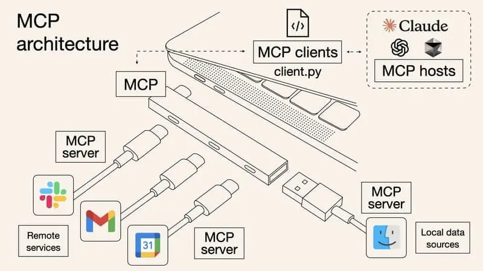
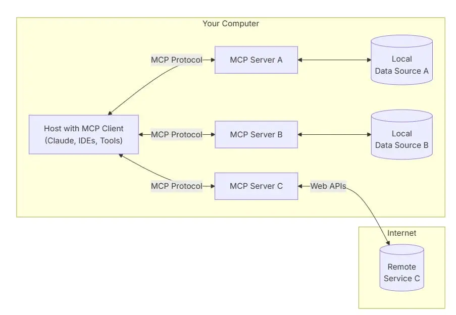
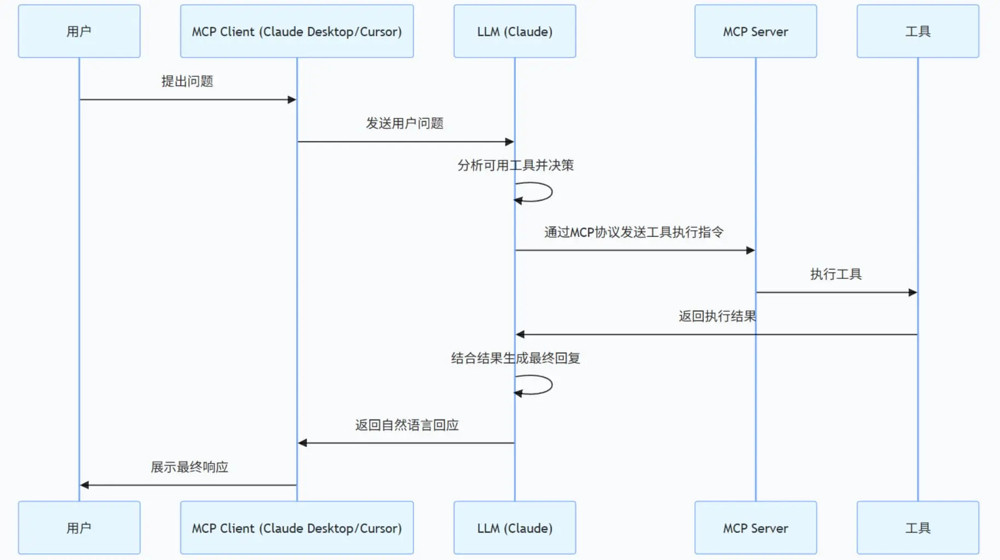
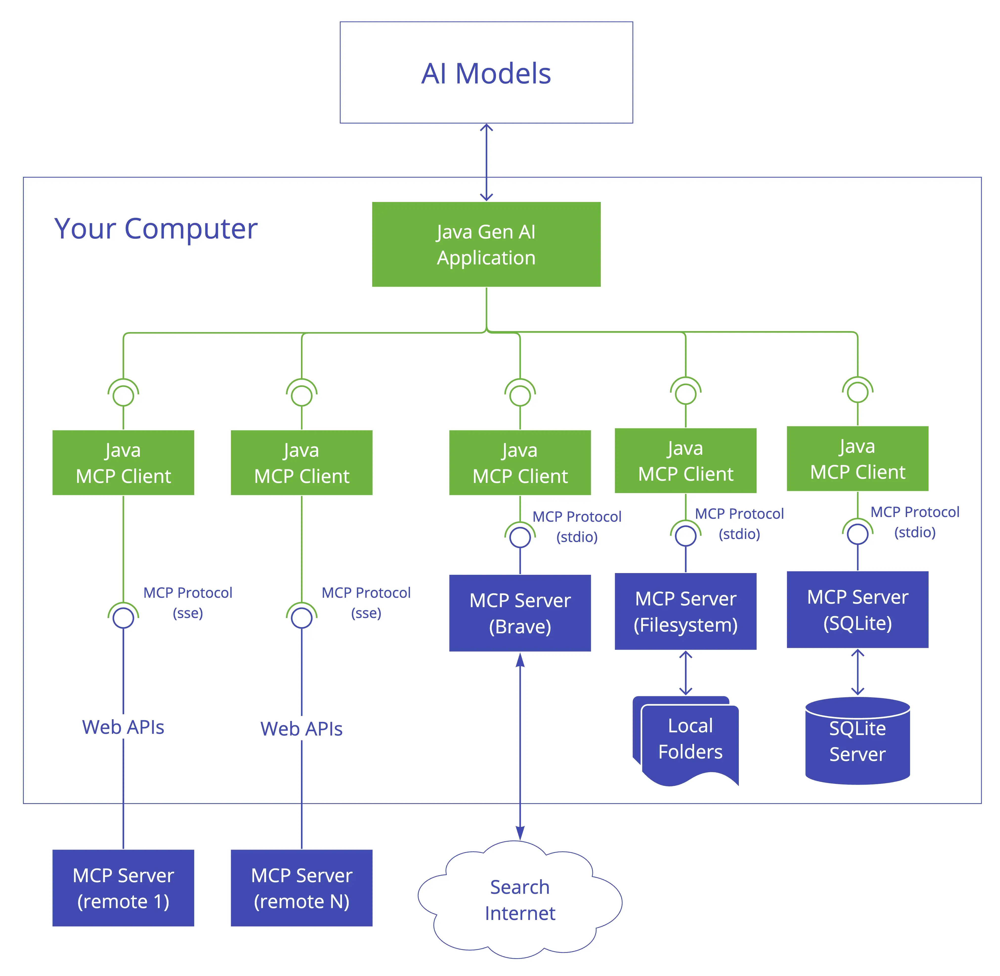
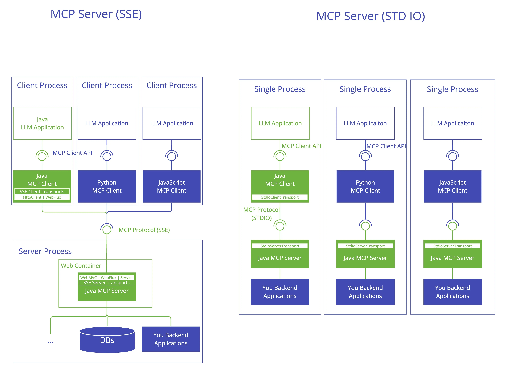
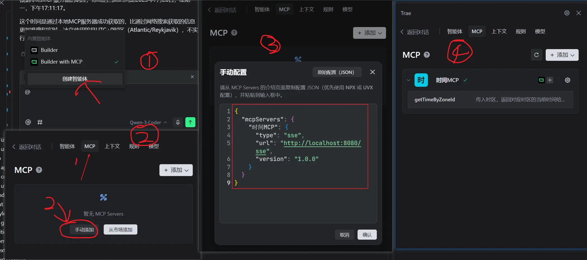
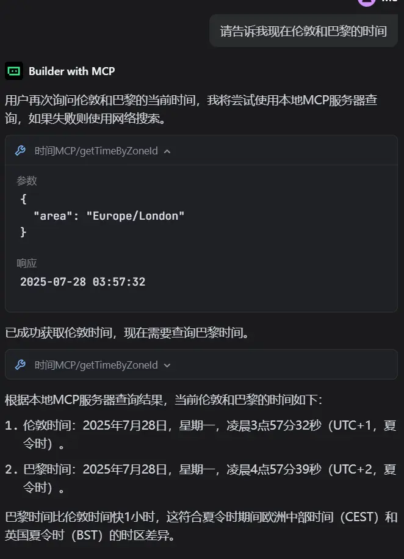

# 07.实现一个查询不同时区当前时间的MCP Server

MCP可以说是25年最火的协议来了，MCP（Model Context Protocol，模型上下文协议）是由 Anthropic 公司于 2024 年底开源的标准化通信协议，旨在解决大模型与外部工具、数据源之间的碎片化集成问题，被誉为 “AI 领域的 USB-C 接口”。

其核心作用是通过统一的协议规范，让大模型（如 Claude、GPT-4、LLaMA 等）能够安全、高效地连接任意工具和数据，而无需为每个系统单独开发适配代码

## 一、MCP简介

在正式创建一个MCP Server之前，我们先了解一下mcp的相关概念

### 1.1 MCP是什么

> MCP （Model Context Protocol，模型上下文协议），它提供了一个通用的开放标准，用于将 AI 系统与数据源连接起来，用单一协议取代碎片化的集成。结果是一种更简单、更可靠的方法，使 AI 系统能够访问所需的数据。这是一种将 AI 助手连接到数据所在的系统（包括内容存储库、业务工具和开发环境）的新标准。其目的是帮助前沿模型产生更好、更相关的响应。


简单来讲，mcp就是定义了标准，对于所有希望给大模型提供能力的小伙伴来说，只要按照这个标准完成能力封装，那么大模型就可以直接加载这些能力从而实现某些特定的功能。

举一个例子，usb大家应该都不陌生，如果你只买一个台式机主机，这个时候你会发现我除了按它的开关按钮之外，好像什么也干不了。然后我买了键盘、鼠标、显示器、摄像头等外设，然后通过usb接口插上之后就可以操作电脑了，电脑是怎么识别这些外接设备（键盘、鼠标、摄像头等）的呢？ 这就是usb协议的作用了，外接设备和电脑，都遵循usb协议，然后大家就可以在同一个频道进行交流了；同样的MCP就是为了干这件事情，让大模型和给大模型提供增强能力的服务能同频进行交流



### 1.2 MCP总体架构

MCP遵循客户端-服务端（CS）的架构，一个主机可以连接多个MCP服务端



从上面的描述和整体架构图，可以看到在MCP的架构中，有三个重要的角色

- MCP Hosts(MCP主机)： 通过mcp协议获取数据的程序（比如 Claude Desktop, IDE 或者 ai工具）
- MCP Clients(MCP客户端): mcp协议客户端，作为调用者，通常与mcp服务端是成对出现，用于连接mcp server，实现双方通信
- MCP Servers(MCP服务端): mcp协议服务端，作为提供者，实现MCP协议提供特定的功能

除了上面三个角色之外，在架构图中，还有两个

- Local Data Sources: MCPServer所在的计算机上本地的资源信息，如文件、数据库、应用服务等，即MCP通过操作(读取、访问、写入等)这些本地资源来提供特定能力
- Remote Service: MCPServer通过调用远程的服务来提供能力


### 1.3 MCP工作原理

mcp只是一个协议，和http协议一样，本身不直接提供能力或者服务，我们能实际感知到的服务表现只是协议上层的应用封装

比如http协议，常见的工作流程是我们打开浏览器，点开网页，通过http协议访问到对应的后台服务器，然后对方将网页信息传输到我们的浏览器上展示为可视化的网页内容，从而实现信息的曝光

那么mcp协议是怎么工作的呢？

1. 用户通过客户端发起提问
2. 客户端将问题传递给 LLM
3. LLM 分析并选择合适的工具
4. 通过 MCP 协议向服务端发送工具执行指令
5. 工具执行后结果返回给 LLM
6. LLM 生成最终回复
7. 回复通过客户端展示给用户



### 1.4 SpringAI MCP 实现

SpringAI提供了MCP的Client/Server的集成，对于上层业务而言，要想实现一个MCP Server/Client比较简单

**MCP客户端**

MCP 客户端是 Model Context Protocol（MCP）架构的核心组件，负责建立并管理与 MCP 服务器的连接。它实现协议的客户端逻辑，主要处理以下功能：

- 协议版本协商以确保与服务器的兼容性
- 功能协商以确定可用特性
- 消息传输及 JSON-RPC 通信
- 工具发现与执行
- 资源访问与管理
- 提示词系统交互
- 可选功能
  - 根目录管理
  - 采样支持
- 同步与异步操作
- 传输协议选项：
  - 基于 Stdio 的进程间通信传输协议
  - 基于 Java HttpClient 的 SSE 客户端传输协议
  - WebFlux SSE 客户端传输协议（用于响应式 HTTP 流式通信）



**MCP服务端**

MCP 服务器是 Model Context Protocol（MCP）架构的基础组件，用于向客户端提供工具、资源和功能。它实现协议的服务端逻辑，主要职责包括：

- 服务端协议操作的实现
  - 工具暴露与发现
  - 基于 URI 的资源管理及访问
  - 提示（Prompt）模板的提供与处理
  - 与客户端的功能协商
  - 结构化日志记录与通知
- 并发客户端连接管理
- 同步与异步 API 支持
- 传输协议实现：
  - 基于 Stdio 的进程间通信传输协议
  - 基于 Servlet 的 SSE 服务器传输协议
  - WebFlux SSE 服务器传输协议（用于响应式 HTTP 流式通信）
  - WebMVC SSE 服务器传输协议（用于基于 Servlet 的 HTTP 流式通信）



## 二、创建一个MCP Server

接下来我们进入正文，如何创建一个MCP Server，并且让我们的大模型能够访问这个MCP Server

### 1. 项目创建

项目创建方式与之前并无差别，创建一个SpringBoot项目，并引入SpringAI的依赖，有需要的小伙伴参考 [创建一个SpringAI-Demo工程](01.创建一个SpringAI-Demo工程.md)

### 1. 依赖配置

在pom配置文件中需要添加核心的依赖，这里是 `spring-ai-starter-mcp-server-webmvc`

```xml
<dependencies>
    <dependency>
        <groupId>org.springframework.boot</groupId>
        <artifactId>spring-boot-starter-web</artifactId>
    </dependency>
    <dependency>
        <groupId>org.springframework.ai</groupId>
        <artifactId>spring-ai-starter-mcp-server-webmvc</artifactId>
    </dependency>
</dependencies>
```

然后在`application.yml`配置文件中，设置MVC Server的相关参数 (下面基本都是默认配置)

```yaml
spring:
  ai:
    mcp:
      server:
        name: date-server
        version: 1.0.0
        type: SYNC
        instructions: "提供获取不同时区的当前时间，并按照北京时间进行展示"
        sse-message-endpoint: /mcp/messages
        sse-endpoint: /sse
        capabilities:
          tool: true # 是否支持工具
          resource: true # 是否支持资源
          prompt: true # 是否支持提示词
          completion: true # 是否支持补全
```

重点参数说明：

- sse-endpoint: 用于 `Web` 传输的自定义 `SSE` 端点路径，MCP Client主要连接的就是这个端点
- sse-message-endpoint: 客户端用于发送消息的端点路径,如后续大模型调用工具时，走的就是这个端点
- type: 服务器类型（同步/异步）

### 2. 创建一个MCP Server

对于SpringAI而言，创建MCP Server和Function calling有点相似，也是通过 `@Tool` 注解将方法声明为工具，区别是一个作为mcp的工具，一个是作为function calling的回调方法

```java
@Service
public class DateService {
  @Tool(description = "传入时区，返回对应时区的当前时间给用户")
  public String getTimeByZoneId(@ToolParam(description = "需要查询时间的时区") ZoneId area) {
    // 根据系统当前时间，获取指定时区的时间
    ZonedDateTime time = ZonedDateTime.now(area);

    // 格式化时间
    DateTimeFormatter formatter = DateTimeFormatter.ofPattern("yyyy-MM-dd HH:mm:ss");
    String ans = time.format(formatter);
    System.out.println("传入的时区是：" + area + "-" + ans);
    return ans;
  }
}
```

然后将这个工具注册为MCP工具暴露给大模型

SpringAI的自动配置将检测并注册来自以下组件的所有工具回调

- 独立的 ToolCallback Bean
- ToolCallback Bean 列表
- ToolCallbackProvider Bean

工具按名称去重，每个工具名称仅保留首次出现的实例，如下创建一个`ToolCallbackProvider`的 `@Bean`

```java
@Configuration
public class ToolConfig {
    @Bean
    public ToolCallbackProvider dateProvider(DateService dateService) {
        return MethodToolCallbackProvider.builder().toolObjects(dateService).build();
    }
}
```

### 3. 启动项目

启动项目，访问[http://localhost:8080/sse](http://localhost:8080/sse), 可以看到MCP Server已经启动了


### 4. Trae配置MCP

接下来我们使用Trae来连接上面实现的mcp server，并使用mcp server提供的工具

以 TraeCN 2.0 为例，下面介绍下具体的配置过程



需要贴在trae中的mcp server的json配置如下

```json
{
  "mcpServers": {
    "时间MCP": {
      "type": "sse",
      "url": "http://localhost:8080/sse",
      "version": "1.0.0"
    }
  }
}
```

然后再来访问看看实际的效果



大模型准确的调用了我们刚才创建的MCPServer，分别返回了伦敦和巴黎的时间

### 5. 小结

到这里我们已经实现了一个功能齐备的MCPServer，整体的代码实现非常简单，在需要作为MCP工具的，在方法上添加`@Tool`注解，然后借助创建`ToolCallbackProvider`将这些工具注册出来即可

本文介绍的是MCP通过http sse实现的，创建MCP Server的实现方式有很多种，这里只是介绍最简单的一种；

在创建一个生成可用的mcp server，目前还缺一个非常关键的认证机制，这个会在接下来的文章进行说明


文中所有涉及到的代码，可以到项目中获取 [https://github.com/liuyueyi/spring-ai-demo](https://github.com/liuyueyi/spring-ai-demo/tree/master/S07-mcp-server)
