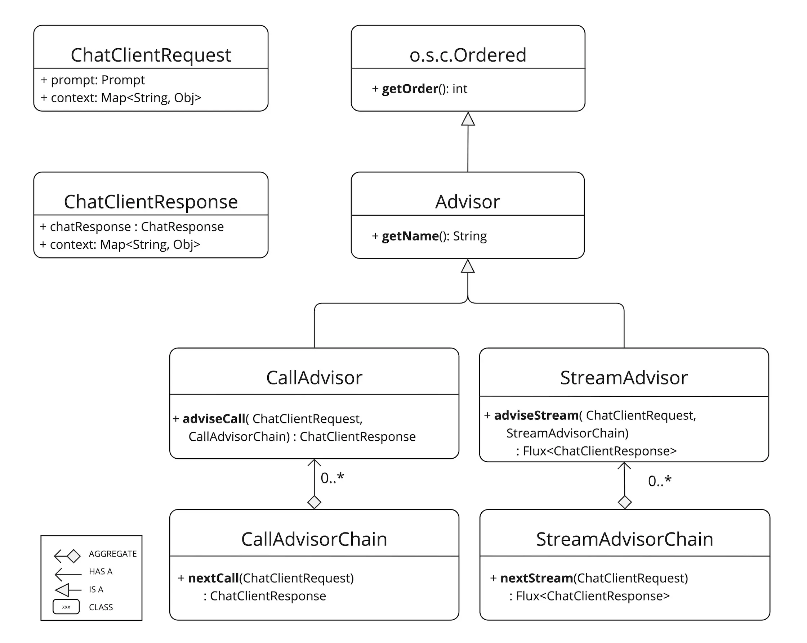
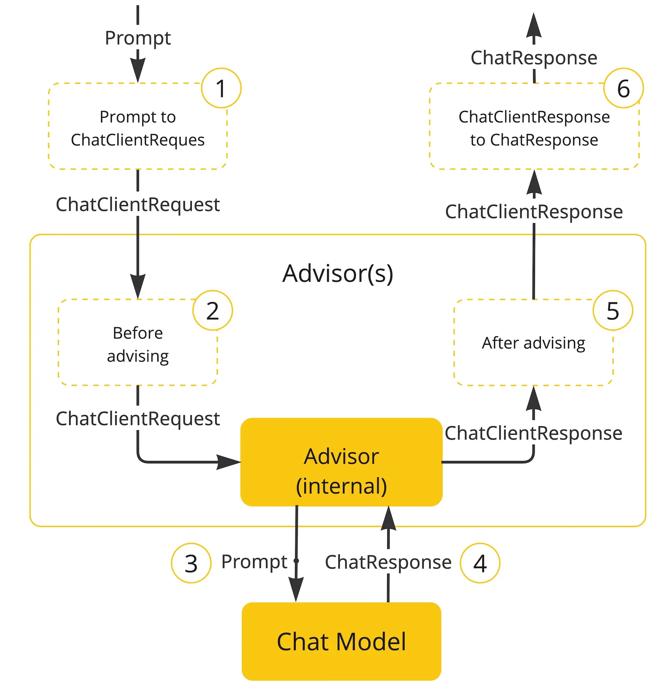
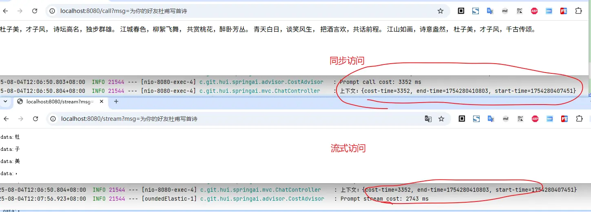
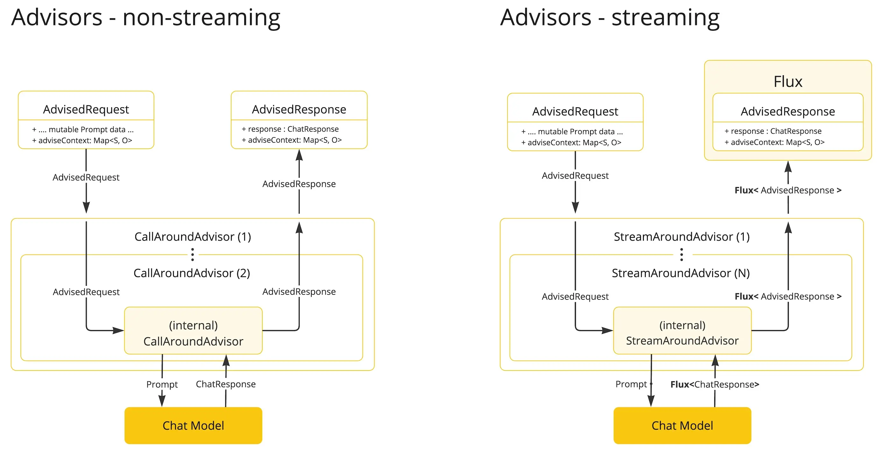

# Advisor实现SpringAI能力增强

SpringAI通过`Advisor API`为拦截、修改、增强Spring应用中的AI交互提供了灵活且强大的能力支撑

核心优势在于：封装可复用的生成式AI模式、转换与大语言模型（LLM）交互的数据、实现跨模型与用例的可移植性。

## 一、基础知识

### 1. 核心组件

因为大模型一般支持同步/异步流式两种访问方式，相应的SpringAI也提供同步调用`call` 和 流式调用 `stream` 两种方式；

这两种不同的方式，对应的`Advisor`也不太一样

- 流式：`StreamAdvisor` 和 `StreamAdvisorChain`
- 非流式：`CallAdvisor` 和 `CallAdvisorChain`

接口定义如下

```java
public interface StreamAdvisor extends Advisor {
    Flux<ChatClientResponse> adviseStream(ChatClientRequest chatClientRequest, StreamAdvisorChain streamAdvisorChain);
}

public interface CallAdvisor extends Advisor {
    ChatClientResponse adviseCall(ChatClientRequest chatClientRequest, CallAdvisorChain callAdvisorChain);
}
```

其中`ChatClientRequest`表示未密封的请求参数，`ChatClientResponse`表示的聊天完成响应的结果



从上面的继承关系图也可以看出，核心的方法为 `adviseCall` 和 `adviseStream`，在这两个方法内，执行检查未密封的 Prompt 数据、定制与增强 Prompt 内容、调用 Advisor 链中的下一实体、选择性阻断请求、分析聊天完成响应，并通过抛出异常标识处理错误等步骤

- getOrder() 方法决定 Advisor 在链中的执行顺序
- getName() 则提供唯一的 Advisor 标识名称

### 2. Advisor执行流程

下面流程图展示了 `Advisor` 链与聊天模型的交互过程：



1. 封装用户的提示词，创建 `ChatClientRequest` 对象，并创建一个空的 `Advisor`上下文对象
2. 链中每个 `Advisor` 依次处理请求并可进行修改，也可选择阻断请求（不调用下一实体）。若选择阻断，该 `Advisor` 需负责填充响应内容。
3. 链中的最后一个 `Advisor` 调用模型
4. 聊天模型响应结果返回给 `Advisor Chain`，并被转换为包含共享 AdvisorContext 实例的 AdvisedResponse 对象。
5. 链中每个 `Advisor` 一次处理或修改响应
6. 通过提取 `ChatCompletion` 内容，最终生成的 `ChatClientResponse` 将返回给客户端

### 3. 执行顺序

链中 Advisor 的执行顺序由 getOrder() 方法决定

1. 数值越小，优先级越高
2. `Advisor` 链采用栈式结构运作
   - 链首的 `Advisor` 优先处理请求
   - 链尾的 `Advisor` 优先处理响应
3. 控制执行顺序
   - 通过调整 `order` 值，来控制执行顺序
   - 当多个`Advisor`的`order`值相同时，则无法完全确认执行顺序

## 二、自定义`Advisor`开发

接下来我们通过实现一个自定义的 `Advisor` 来实现大模型交互的耗时统计

### 1. 耗时统计Advisor

接下来，我们实现一个简单的 `advisor` 用于统计大模型的耗时情况。首先创建一个 `CostAdvisor` 分别实现 `CallAdvisor` 和 `StreamAdvisor` 接口，让它同时适用于同步/流式场景

```java
public class CostAdvisor implements CallAdvisor, StreamAdvisor {
   @Override
   public ChatClientResponse adviseCall(ChatClientRequest chatClientRequest, CallAdvisorChain callAdvisorChain) {
       
   }

   @Override
   public Flux<ChatClientResponse> adviseStream(ChatClientRequest chatClientRequest, StreamAdvisorChain streamAdvisorChain) {
       
   }
}
```

接下来是关键的类实现，既然是耗时统计，那就设定这个 `Advisor` 优先级最高，在执行前后分别计时，用于获取耗时情况；并将相关信息写入到上下文中

因此一个完整的实现可以如下：

```java
public class CostAdvisor implements CallAdvisor, StreamAdvisor {
    private static final Logger log = org.slf4j.LoggerFactory.getLogger(CostAdvisor.class);

    /**
     * 同步调用
     *
     * @param chatClientRequest
     * @param callAdvisorChain
     * @return
     */
    @Override
    public ChatClientResponse adviseCall(ChatClientRequest chatClientRequest, CallAdvisorChain callAdvisorChain) {
        long start = System.currentTimeMillis();
        chatClientRequest.context().put("start-time", start);
        
        // AdvisorChain 的调度执行 (有点类似 Filter 的链式执行 )
        ChatClientResponse response = callAdvisorChain.nextCall(chatClientRequest);
        
        long end = System.currentTimeMillis();
        long cost = end - start;
        response.context().put("end-time", end);
        response.context().put("cost-time", cost);
        log.info("Prompt call cost: {} ms", cost);
        return response;
    }

    /**
     * 流式调用
     *
     * @param chatClientRequest
     * @param streamAdvisorChain
     * @return
     */
    @Override
    public Flux<ChatClientResponse> adviseStream(ChatClientRequest chatClientRequest, StreamAdvisorChain streamAdvisorChain) {
        long start = System.currentTimeMillis();
        chatClientRequest.context().put("start-time", start);
        Flux<ChatClientResponse> response = streamAdvisorChain.nextStream(chatClientRequest);
        return new ChatClientMessageAggregator().aggregateChatClientResponse(response, (res) -> {
            long end = System.currentTimeMillis();
            long cost = end - start;
            // 添加耗时
            res.context().put("end-time", end);
            res.context().put("cost-time", cost);
            log.info("Prompt stream cost: {} ms", cost);
        });
    }

    @Override
    public String getName() {
        return "costAdvisor";
    }

    @Override
    public int getOrder() {
        // 指定最高优先级
        return Integer.MIN_VALUE;
    }
}
```

同步的实现比较好理解，重点说一下流式调用中，耗时时间的打印情况，这里借助的`MessageAggregator`工具类，用于将 Flux 响应聚合为 `AdvisedResponse`。适用于观察完整响应（即回答完毕之后），记录耗时时间

其次就是上下文的传递，可以通过 `chatClientRequest.context().put("start-time", start);` 和 `response.context().put("end-time", end);` 方式设置用于共享的上下文参数

### 2. 测试验证

写一个简单的端点用于验证 CostAdvisor

```java
@RestController
public class ChatController {

    private static final org.slf4j.Logger log = org.slf4j.LoggerFactory.getLogger(ChatController.class);

    private final ChatClient chatClient;

    public ChatController(ChatModel chatModel) {
        chatClient = ChatClient.builder(chatModel)
                .defaultSystem("你现在扮演盛唐的著名诗人李白，我们开始对话")
                .defaultAdvisors(new CostAdvisor())
                .build();
    }

    @GetMapping("/call")
    public String call(String msg) {
        ChatClientResponse response = chatClient.prompt(msg).call().chatClientResponse();
        log.info("上下文：{}", response.context());
        return response.chatResponse().getResult().getOutput().getText();
    }

    @GetMapping(path = "/stream", produces = "text/event-stream")
    public Flux<String> stream(String msg) {
        Flux<String> ans = chatClient.prompt(msg).stream().content();
        return ans;
    }
}
```



从上面的访问截图也可以看出，`CostAdvisor` 拦截了请求，并记录了耗时情况，并打印在控制台


## 三、小结

本篇文章主要介绍了SpringAI如何通过 `Advisor` 来实现大模型交互能力的增强，并通过实现了一个简单的 `CostAdvisor` 演示如何实现自定义的advisor

SpringAI 内置了一些常用的 advisor， 比如我们之前介绍过的上下文、日志打印等

1. 对话历史相关

- `MessageChatMemoryAdvisor`
  - 检索记忆并将其作为信息集合添加到提示中。这种方法可以保持对话历史的结构。注意，并非所有人工智能模型都支持这种方法。
- `PromptChatMemoryAdvisor`
  - 检索记忆内容并将其整合到提示词的系统文本中。
- `VectorStoreChatMemoryAdvisor`
  - 从向量存储库检索记忆内容并注入提示词的系统文本。该 Advisor 能高效搜索海量数据集中的相关信息。

2. 问答相关

- `QuestionAnswerAdvisor`
  - 该 Advisor 通过向量存储实现问答功能，采用检索增强生成（RAG）模式。

3. 内容安全

- `SafeGuardAdvisor`
  - 基础防护型 Advisor，用于阻止模型生成有害或不恰当内容。


此外需要重点注意的是，我们实现的 `advisor` 需要同时考虑同步和流式的两种方式



- 非流式 Advisor 处理完整请求与响应。
- 流式 Advisor 采用响应式编程理念（如 Flux 处理响应），以连续流形式处理请求与响应。

```java
@Override
public Flux<ChatClientResponse> adviseStream(ChatClientRequest chatClientRequest, StreamAdvisorChain chain) {
    return  Mono.just(chatClientRequest)
            .publishOn(Schedulers.boundedElastic())
            .map(request -> {
                // This can be executed by blocking and non-blocking Threads.
                // Advisor before next section
            })
            .flatMapMany(request -> chain.nextStream(request))
            .map(response -> {
                // Advisor after next section
            });
}
```

文中所有涉及到的代码，可以到项目中获取 [https://github.com/liuyueyi/spring-ai-demo](https://github.com/liuyueyi/spring-ai-demo/tree/master/S10-cost-advise)

