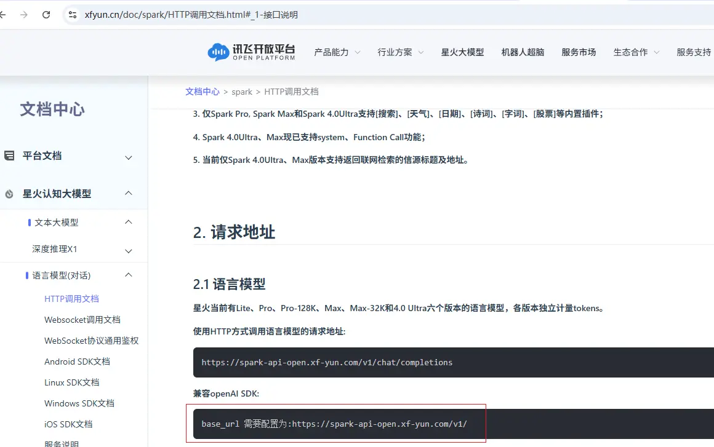
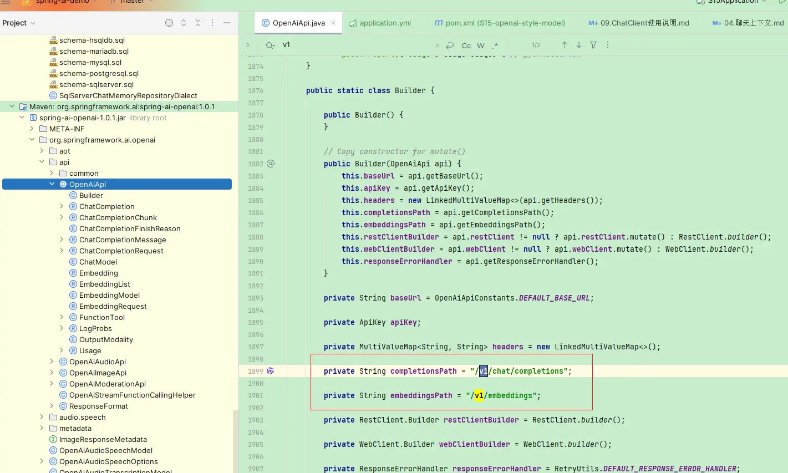

# 15.接入OpenAI接口风格的大模型

鉴于OpenAI在业内的地位，很多大模型的调用接口都是兼容OpenAI的，因此，在接入OpenAI的接口风格大模型时，若官方没有提供高可用的starter，那么直接使用OpenAI的starter就是一个非常好的选择了

接下来我们将演示一下，如何通过OpenAI的starter接入讯飞大模型

## 一、项目初始化

### 1. 项目创建

创建一个SpringBoot项目，并引入SpringAI依赖，基本流程如 [创建一个SpringAI-Demo工程](01.创建一个SpringAI-Demo工程.md)

### 2. 添加依赖

我们这里直接使用OpenAI的starter作为大模型交互的工具，因此直接在依赖中，添加对应的stater即可

```xml
<dependencies>
    <dependency>
        <groupId>org.springframework.boot</groupId>
        <artifactId>spring-boot-starter-web</artifactId>
    </dependency>
    <dependency>
        <groupId>org.springframework.ai</groupId>
        <artifactId>spring-ai-starter-model-openai</artifactId>
    </dependency>
</dependencies>
```

### 3. 配置文件

以讯飞星火为例，我们首先当官网申请对应的apiKey，并添加到配置文件中(或者通过环境变量、启动参数的方式传入)

```yaml
spring:
  ai:
    openai:
      # api-key 使用你自己申请的进行替换；如果为了安全考虑，可以通过启动参数进行设置
      api-key: ${spark-api-key}
      chat: # 聊天模型
        options:
          model: lite
      base-url: https://spark-api-open.xf-yun.com

# 修改日志级别
logging:
  level:
    org.springframework.ai.chat.client.advisor.SimpleLoggerAdvisor: debug
```

注意看上面的配置，参数是放在 `spring.ai.openai` 下面的

另外一个需要注意的点就是 `base-url`



虽然官方文档中给出的地址是 [https://spark-api-open.xf-yun.com/v1/](https://spark-api-open.xf-yun.com/v1/)，但是我们不需要添加 `/v1`，原因在于OpenAI的实现中，已经自动补上了这个前缀



## 二、测试验证

接下来我们验证一下大模型的调用

### 1. 联调接口实现

```java
@RestController
public class ChatController {

    private final ChatClient chatClient;

    public ChatController(ChatModel chatModel) {
        chatClient = ChatClient.builder(chatModel)
                .defaultAdvisors(new SimpleLoggerAdvisor())
                .build();
    }

    @GetMapping(path = "chat")
    public String chat(String msg) {
        return chatClient.prompt(msg).call().content();
    }
}
```

使用方式和前面介绍的SpringAI大模型调用没有任何区别，直接使用注入的`ChatModel`或者基于 `ChatModel` 创建 `ChatClient`

### 2. 访问验证

接下来直接访问这个接口，看看是否可以实现大模型的对话

```bash
curl 'http://localhost:8080/chat?msg=介绍一下你自己的能力'
```


### 3. 手动创建模型

上面介绍的是直接使用注入的`ChatModel`或者基于 `ChatModel` 创建 `ChatClient`；若我们一个项目中，存在多个满足OpenAi风格的大模型，则直接使用上面的方式不太优雅，因此，我们可以手动创建模型

```java
@RestController
public class ChatController {
    /**
     * 阿里的百炼模型
     */
    private final ChatModel dashModel;


    public ChatController(Environment environment) {
        // 通过手动的方式，注册 阿里百炼模型
        OpenAiApi openAiApi = OpenAiApi.builder().apiKey(getDashApiKey(environment))
                .baseUrl("https://dashscope.aliyuncs.com/compatible-mode")
                .build();
        dashModel = OpenAiChatModel.builder()
                .openAiApi(openAiApi)
                .defaultOptions(OpenAiChatOptions.builder().model("qwen-plus").build())
                .build();

    }


    private String getDashApiKey(Environment environment) {
        final String key = "dash-api-key";
        // 1. 通过 --dash-api-key 启动命令传参
        String val = environment.getProperty(key);
        if (StringUtils.isBlank(val)) {
            // 2. 通过jvm传参 -Ddash-api-key=
            val = System.getProperty(key);
            if (val == null) {
                // 3. 通过环境变量传参
                val = System.getenv(key);
            }
        }
        return val;
    }


    /**
     * 阿里百炼模型
     *
     * @param msg
     * @return
     */
    @GetMapping(path = "aliChat")
    public String aliChat(String msg) {
        return dashModel.call(new UserMessage(msg));
    }
}
```


## 三、总结

本文主要介绍符合OpenAI接口风格的大模型接入方式，直接通过SpringAI-OpenAI的starter接入，或者手动创建模型，都可以实现便捷的大模型使用

文中所有涉及到的代码，可以到项目中获取 [https://github.com/liuyueyi/spring-ai-demo](https://github.com/liuyueyi/spring-ai-demo/tree/master/S15-openai-style-model)

