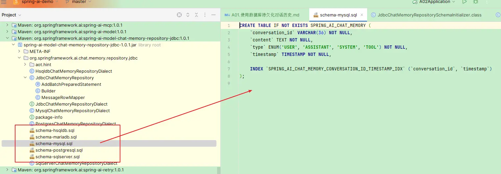
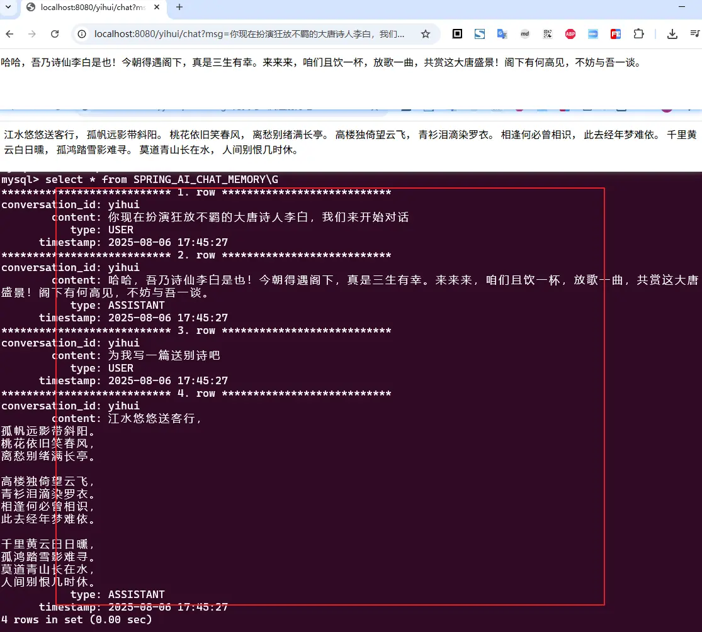
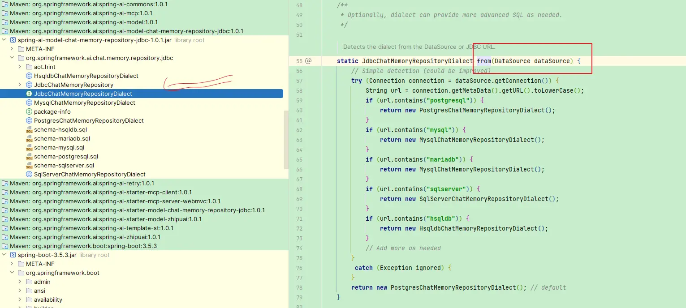
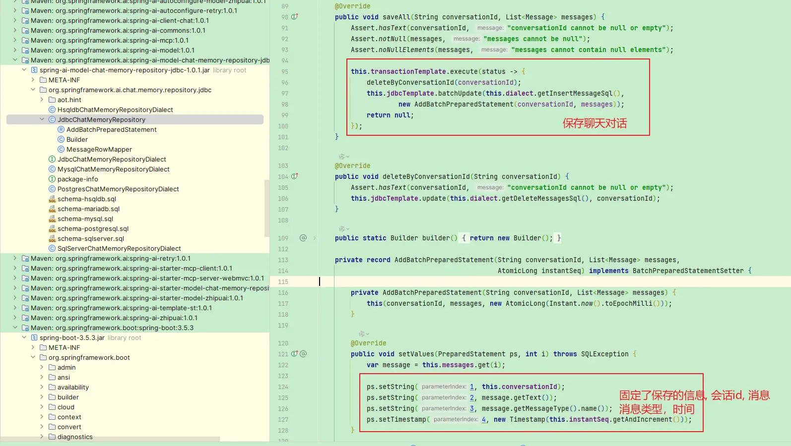

# 01.使用数据库持久化对话历史

本文作为SpringAI的进阶篇，将介绍一些在实际应用中，可能用到的小技巧。在基础篇的 [04.聊天上下文](./04.聊天上下文.md)
中，介绍并演示了基于 `InMemoryChatMemoryRepository` 来存储对话历史，从而实现多轮对话

在实际的业务场景中，用`InMemoryChatMemoryRepository`的场景可能还会更少一点，毕竟上下文放在内存中，不利于后续的审计以及应用重启之后数据就丢失了

那么如何将对话持久化存储呢?

本文将介绍基于数据库的持久方案，将从两个方面进行介绍

1. 通过实例演示数据库的持久化使用方式
2. 介绍一些关键的实现技术点

## 一、项目演示

### 1. 创建项目

创建一个SpringAI项目，基本流程同 [创建一个SpringAI-Demo工程](01.创建一个SpringAI-Demo工程.md)

### 2. 添加依赖

在pom.xml中添加关键依赖

```xml

<dependencies>
    <dependency>
        <groupId>org.springframework.boot</groupId>
        <artifactId>spring-boot-starter-web</artifactId>
    </dependency>
    <dependency>
        <groupId>org.springframework.ai</groupId>
        <artifactId>spring-ai-starter-model-zhipuai</artifactId>
    </dependency>
    <dependency>
        <groupId>org.springframework.ai</groupId>
        <artifactId>spring-ai-starter-model-chat-memory-repository-jdbc</artifactId>
    </dependency>
    <dependency>
        <groupId>com.mysql</groupId>
        <artifactId>mysql-connector-j</artifactId>
    </dependency>
</dependencies>
```

### 3. 配置数据库连接

在配置文件 `application.yml` 文件中，指定SpringAI配置 + 数据库连接信息

```yaml
spring:
  datasource:
    url: jdbc:mysql://localhost:3306/ai-oc-my?useUnicode=true&allowPublicKeyRetrieval=true&autoReconnect=true&characterEncoding=UTF-8&useSSL=false&serverTimezone=Asia/Shanghai
    username: root
    password:
  ai:
    chat:
      memory:
        repository:
          jdbc:
            # 自动创建表，表对应的schema在 spring-ai-starter-model-chat-memory-repository-jdbc 包下的 schema-mysql.sql 文件中
            initialize-schema: always
    zhipuai:
      # api-key 使用你自己申请的进行替换；如果为了安全考虑，可以通过启动参数进行设置
      api-key: ${zhipuai-api-key}
      chat: # 聊天模型
        options:
          model: GLM-4-Flash


# 修改日志级别
logging:
  level:
    org.springframework.ai.chat.client.advisor.SimpleLoggerAdvisor: debug
```

关于`spring.ai.chat.memory.repository.jdbc`的配置进行一些必要的说明

| 配置                                                        | 描述                          | 取值                                                                                     |
|-----------------------------------------------------------|-----------------------------|----------------------------------------------------------------------------------------|
| `spring.ai.chat.memory.repository.jdbc.initialize-schema` | 控制什么时候初始化schema             | embeded(默认)/always/never                                                               |
| `spring.ai.chat.memory.repository.jdbc.schema`            | 指定数据库的schema的位置             | `classpath:org/springframework/ai/chat/memory/repository/jdbc/schema-@@platform@@.sql` |
| `spring.ai.chat.memory.repository.jdbc.platform`          | 数据库平台，如mysql/h2/postgresql等 | 默认会自动检测                                                                                |

在上面的配置中，我们的 `initialize-schema` 配置为 `always`，表示在启动的时候会自动创建数据库表（即便表存在，也会尝试执行脚本；我们这里使用的是MySql，因此需要自动创建表`SPRING_AI_CHAT_MEMORY`）

1. ALWAYS
- 无论何时都会执行数据库初始化
- 即使数据库已存在，也会尝试运行初始化脚本
- 适用于每次启动都需要重新初始化数据库的场景

2. EMBEDDED
- 仅在使用嵌入式数据库时执行初始化
- 对于H2、HSQL、Derby等嵌入式数据库会自动初始化
- 对于外部数据库（如MySQL、PostgreSQL）则跳过初始化
- 这是大多数情况下的推荐设置

3. NEVER
- 从不执行数据库初始化
- 完全跳过所有数据库schema和data脚本的执行
- 适用于生产环境或已有数据库结构的情况

对应的Schema所在的位置如下图



### 4. 初始化 ChatMemory

当我们引入 `spring-ai-starter-model-chat-memory-repository-jdbc` 之后，会自动注入 `ChatMemoryRepository`
的bean对象，我们接下来基于它来创建`ChatMemory`

```java

@Configuration
public class MemConfig {
    @Bean
    public ChatMemory jdbcChatMemory(ChatMemoryRepository chatMemoryRepository) {
        return MessageWindowChatMemory.builder()
                .chatMemoryRepository(chatMemoryRepository)
                .build();
    }
}
```

### 5. ChatClient 配置

然后通过`MessageChatMemoryAdvisor`来为`ChatClient`提供聊天历史能力支撑

```java

@RestController
public class ChatController {
    private final ChatClient chatClient;

    public ChatController(ChatModel chatModel, ChatMemory chatMemory) {
        this.chatClient = ChatClient.builder(chatModel)
                .defaultAdvisors(MessageChatMemoryAdvisor.builder(chatMemory).build(),
                        new SimpleLoggerAdvisor())
                .build();
    }
}
```

### 6. 示例测试

提供一个聊天接口，第一个参数为用户标识，用于区分用户的聊天记录

```java
@RestController
public class ChatController {
    /**
     * 聊天对话
     *
     * @param user
     * @param msg
     * @return
     */
    @GetMapping("/{user}/chat")
    public Object chat(@PathVariable String user, String msg) {
        return chatClient.prompt().user(msg)
                .advisors(a -> a.param(ChatMemory.CONVERSATION_ID, user))
                .call().content();
    }
}
```



## 二、关键技术点

使用MySql来存储用户与大模型的对话情况，从使用角度来看，还比较简单；接下来我们抓一下技术要点，从疑问出发，看下能否完成解惑

1. 持久化的数据表结构是如何设计的？
2. 数据库表是如何初始化的？
3. 又是如何实现自动识别数据库平台的？
4. 如果想使用自定义的数据库表，替代默认的，可以怎么实现？

### 1. 默认的表结构设计

关于这个一点，前面介绍配置的时候也提到了，在`spring-aimodel-chat-memory-repository-jdbc`的包中，提供了5个schema文件，对应的源码工程结果如下


以mysql为例，对应的schema如下

```sql
CREATE TABLE IF NOT EXISTS SPRING_AI_CHAT_MEMORY (
    `conversation_id` VARCHAR(36) NOT NULL,
    `content` TEXT NOT NULL,
    `type` ENUM('USER', 'ASSISTANT', 'SYSTEM', 'TOOL') NOT NULL,
    `timestamp` TIMESTAMP NOT NULL,
    INDEX `SPRING_AI_CHAT_MEMORY_CONVERSATION_ID_TIMESTAMP_IDX` (`conversation_id`, `timestamp`)
);
```

定义了四个字段，分别为：

- `conversation_id`: 会话ID，用于区分不同的会话
- `content`: 会话内容，可以是用户输入，也可以是模型输出
- `type`: 会话类型，可以是用户输入，也可以是模型输出，也可以是系统信息，也可以是工具信息
- `timestamp`: 会话时间，用于排序

### 2. 数据库初始化

通过配置 `spring.ai.chat.memory.repository.jdbc.initialize-schema` 来控制； 为 `always`，会自动创建数据库表（即便表存在，也会尝试执行脚本）

这里主要是通过`JdbcChatMemoryRepositorySchemaInitializer`来实现schema脚本的初始化行为，依赖的是Spring Boot 中用于数据库初始化的组件`DataSourceScriptDatabaseInitializer`

- 检查数据库初始化模式（DatabaseInitializationMode）
- 根据配置查找相应的 SQL 脚本文件
- 使用配置的 DataSource 连接数据库
- 按顺序执行 schema 脚本和 data 脚本
- 处理脚本执行过程中的异常

### 3. 自动识别数据库平台

关键实现逻辑  `org.springframework.ai.chat.memory.repository.jdbc.JdbcChatMemoryRepositoryDialect.from`



根据数据库连接来判断当前使用的是哪个数据库，默认的是 `postgresql`

### 4. 自定义数据库表结构

默认的表结构满足大部分场景，如果需要自定义表结构，可以通过实现 `JdbcChatMemoryRepositoryDialect` 接口来自定义，并注册到 Spring 容器中


比如默认的MySql相关sql如下，若需要调整表名、字段名，替换下面的这个类，然后注册到 `JdbcChatMemoryRepository` 中即可

```java
public class MysqlChatMemoryRepositoryDialect implements JdbcChatMemoryRepositoryDialect {

    @Override
    public String getSelectMessagesSql() {
        return "SELECT content, type FROM SPRING_AI_CHAT_MEMORY WHERE conversation_id = ? ORDER BY `timestamp`";
    }

    @Override
    public String getInsertMessageSql() {
        return "INSERT INTO SPRING_AI_CHAT_MEMORY (conversation_id, content, type, `timestamp`) VALUES (?, ?, ?, ?)";
    }

    @Override
    public String getSelectConversationIdsSql() {
        return "SELECT DISTINCT conversation_id FROM SPRING_AI_CHAT_MEMORY";
    }

    @Override
    public String getDeleteMessagesSql() {
        return "DELETE FROM SPRING_AI_CHAT_MEMORY WHERE conversation_id = ?";
    }
}
```

重点说明：换表名、字段名还好，如果我想额外存储用户的token使用情况，可行吗？

从源码来看，不可行，上面的 `Dialect` 中的`insert`，已经绑定了字段，无法进行动态扩展




## 三、小结

本文介绍的是基于MySql持久化对话历史的实现方案，Spring AI 默认使用 JdbcChatMemoryRepository 来实现，基于 MySql 的表结构，可以满足大部分场景，如果需要自定义表结构，可以通过实现 `JdbcChatMemoryRepositoryDialect` 接口来自定义

通过使用实例和一些关键性的技术说明，对于官方未直接支持的数据库，我们也可以很方便的进行扩展；当然现在的实现还存在一点缺陷，那就是无法自定义持久化的信息

接下来一篇博文，我们将实例演示，如何使用 h2 数据库进行持久化


文中所有涉及到的代码，可以到项目中获取 [https://github.com/liuyueyi/spring-ai-demo](https://github.com/liuyueyi/spring-ai-demo/tree/master/advance-projects/A01-memory-jdbc-mysql)
