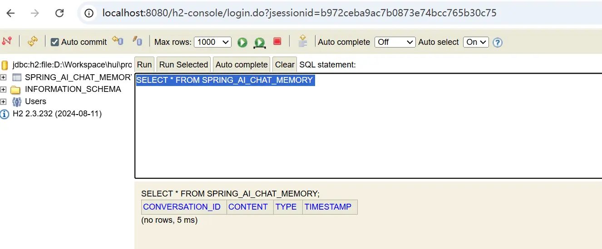

# 02.使用H2持久化对话历史

上面一篇文章介绍了 SpringAI官方提供的 jdbc start来实现持久化对话历史 [使用MySql持久化对话历史](./A01.使用MySql持久化对话历史.md)，官方实现的几个数据库已经很有代表性了，接下来我们将看一下，如果沿用官方的思路，来为h2添加持久化对话历史功能。

## 一、H2持久化对话历史

### 1. 创建项目

创建一个SpringAI项目，基本流程同 [创建一个SpringAI-Demo工程](01.创建一个SpringAI-Demo工程.md)

### 2. 添加依赖

在pom.xml中添加关键依赖

```xml
<dependencies>
    <dependency>
        <groupId>org.springframework.boot</groupId>
        <artifactId>spring-boot-starter-web</artifactId>
    </dependency>
    <dependency>
        <groupId>org.springframework.ai</groupId>
        <artifactId>spring-ai-starter-model-zhipuai</artifactId>
    </dependency>
    <dependency>
        <groupId>org.springframework.ai</groupId>
        <artifactId>spring-ai-starter-model-chat-memory-repository-jdbc</artifactId>
    </dependency>
    <dependency>
        <groupId>com.h2database</groupId>
        <artifactId>h2</artifactId>
        <scope>runtime</scope>
    </dependency>
</dependencies>
```

### 3. 配置数据库连接

在配置文件 `application.yml` 文件中，指定SpringAI配置 + 数据库连接信息

```yaml
spring:
  datasource:
    # 本地开发环境，使用h2数据库，减少外部依赖项
    url: jdbc:h2:file:${user.dir}/advance-projects/A02-memory-jdbc-h2/datas/test-db;DB_CLOSE_DELAY=-1
    driver-class-name: org.h2.Driver
    username: sa
    password:
  h2:
    console:
      enabled: true
  ai:
    chat:
      memory:
        repository:
          jdbc:
            # 因为我们使用的是 h2:file 方式，因此这里还是选择 always 始终创建数据库，不然不会自动创建表
            # 如果我们使用的是 h2:mem 模式，则这里选择 embedded，SpringBoot会自行执行下面的 schema
            initialize-schema: always
            schema: classpath:schema-h2.sql
            platform: h2
    zhipuai:
      # api-key 使用你自己申请的进行替换；如果为了安全考虑，可以通过启动参数进行设置
      api-key: ${zhipuai-api-key}
      chat: # 聊天模型
        options:
          model: GLM-4-Flash

# 修改日志级别
logging:
  level:
    org.springframework.ai.chat.client.advisor.SimpleLoggerAdvisor: debug
```

说明，虽然我们这里使用的是 H2，但是 `spring.ai.chat.memory.repository.jdbc.initialize-schema` 配置项，还是建议选择 `always`，因为上面配置的是使用文件来存储db；如果使用内存 `jdbc:h2:mem` 的方式，则这里可以选择 `embedded`


其次就是我们需要指定 `schema` 文件，这个文件，就是用来创建数据库表结构，这里我们使用 `h2` 的默认结构，因此这里我们使用 `classpath:schema-h2.sql`

```sql
CREATE TABLE IF NOT EXISTS SPRING_AI_CHAT_MEMORY
(
    `conversation_id` VARCHAR(36)                                  NOT NULL,
    `content`         TEXT                                         NOT NULL,
    `type`            ENUM ('USER', 'ASSISTANT', 'SYSTEM', 'TOOL') NOT NULL,
    `timestamp`       TIMESTAMP                                    NOT NULL
);
```

### 4. 初始化 ChatMemory

因为我们使用的是系统未提供支持的h2，因此无法使用自动注入的`ChatMemoryRepository`，因为它选择的Dialect是 `PostgresChatMemoryRepositoryDialect`，无法支持h2的使用场景

我们这里直接使用`MysqlChatMemoryRepositoryDialect`来作为h2的Dialect（当然也可以自行实现一个Dialect）

```java
@Configuration
public class MemConfig {
    @Bean
    public ChatMemory jdbcChatMemory(JdbcTemplate jdbcTemplate) {
        ChatMemoryRepository chatMemoryRepository = JdbcChatMemoryRepository.builder()
                .jdbcTemplate(jdbcTemplate)
                // 在这里，指定不同数据库对应的Dialect
                .dialect(new MysqlChatMemoryRepositoryDialect())
                .build();

        return MessageWindowChatMemory.builder()
                .chatMemoryRepository(chatMemoryRepository)
                .build();
    }
}
```

### 5. ChatClient 配置

然后通过`MessageChatMemoryAdvisor`来为`ChatClient`提供聊天历史能力支撑

```java

@RestController
public class ChatController {
    private final ChatClient chatClient;

    public ChatController(ChatModel chatModel, ChatMemory chatMemory) {
        this.chatClient = ChatClient.builder(chatModel)
                .defaultAdvisors(MessageChatMemoryAdvisor.builder(chatMemory).build(),
                        new SimpleLoggerAdvisor())
                .build();
    }
}
```

### 6. 示例测试

提供一个聊天接口，第一个参数为用户标识，用于区分用户的聊天记录

```java
@RestController
public class ChatController {
    /**
     * 聊天对话
     *
     * @param user
     * @param msg
     * @return
     */
    @GetMapping("/{user}/chat")
    public Object chat(@PathVariable String user, String msg) {
        return chatClient.prompt().user(msg)
                .advisors(a -> a.param(ChatMemory.CONVERSATION_ID, user))
                .call().content();
    }
}
```

启动成功之后，我们可以在h2-console中看到新增了一个表 `SPRING_AI_CHAT_MEMORY`



然后进行多轮对话，看看效果，表现和我们预期一致，聊天记录被保存在数据库中


## 二、小结

本文介绍的是如何借助 `spring-ai-starter-model-chat-memory-repository-jdbc` 来实现自定义的对话持久化，通过实现h2的Dialect，我们可以轻松实现自定义的持久化逻辑；若希望了解持久化的更多实现细节，可以查看上篇 [使用MySql持久化对话历史](./A01.使用MySql持久化对话历史.md)

文中所有涉及到的代码，可以到项目中获取 [https://github.com/liuyueyi/spring-ai-demo](https://github.com/liuyueyi/spring-ai-demo/tree/master/advance-projects/A02-memory-jdbc-h2)
