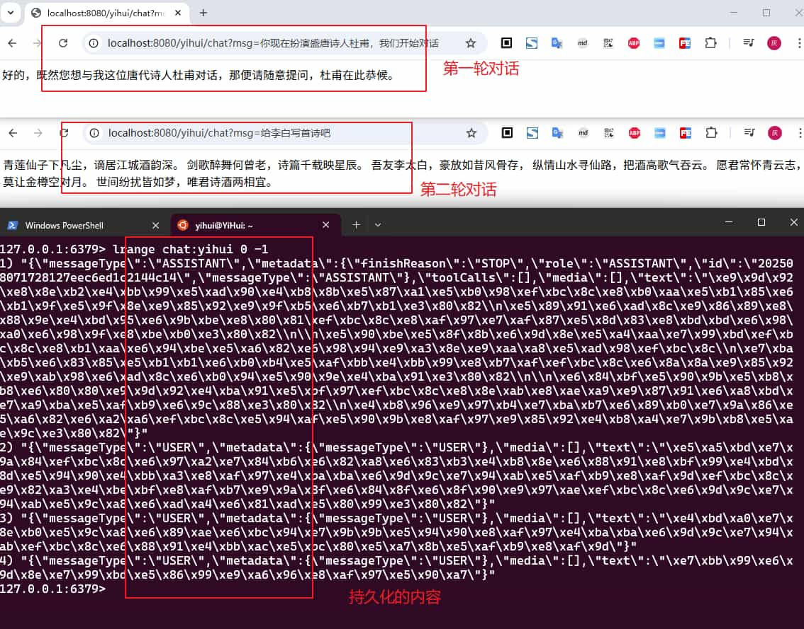

# 03.使用Redis持久化对话历史

前面介绍了使用关系数据库来存储对话历史，接下来我们更进一步，通过扩展`ChatMemoryRepository`来实现基于Redis的持久化

## 一、Redis持久化对话历史

### 1. 创建项目

创建一个SpringAI项目，基本流程同 [创建一个SpringAI-Demo工程](01.创建一个SpringAI-Demo工程.md)

### 2. 添加依赖

在pom.xml中添加关键依赖

```xml
<dependencies>
    <dependency>
        <groupId>org.springframework.boot</groupId>
        <artifactId>spring-boot-starter-web</artifactId>
    </dependency>
    <dependency>
        <groupId>org.springframework.ai</groupId>
        <artifactId>spring-ai-starter-model-zhipuai</artifactId>
    </dependency>
    <dependency>
        <groupId>org.springframework.ai</groupId>
        <artifactId>spring-ai-starter-model-chat-memory</artifactId>
    </dependency>
    <dependency>
        <groupId>org.springframework.data</groupId>
        <artifactId>spring-data-redis</artifactId>
    </dependency>
    <dependency>
        <groupId>redis.clients</groupId>
        <artifactId>jedis</artifactId>
    </dependency>
</dependencies>
```

直接依赖`spring-ai-starter-model-chat-memory`来实现聊天记录，这里采用redis来进行持久化，因此我们添加redis的相关依赖（这里一jedis客户端为例，对于lettuce或者redisson实际上没有太大的差别）

### 3. 配置

在配置文件 `application.yml` 文件中，指定redis相关配置

```yaml
spring:
  ai:
    zhipuai:
      # api-key 使用你自己申请的进行替换；如果为了安全考虑，可以通过启动参数进行设置
      api-key: ${zhipuai-api-key}
      chat: # 聊天模型
        options:
          model: GLM-4-Flash
  data:
    redis: # redis 配置
      host: localhost
      port: 6379
      password:

# 修改日志级别
logging:
  level:
    org.springframework.ai.chat.client.advisor.SimpleLoggerAdvisor: debug
```

我们这里使用单节点的redis进行演示；对于集群的场景，除了配置不一样之外，实际上对于我们的实现并没有太大的差别（因为我们利用的是Spring封装的RedisTemplate进行操作，因此对于集群的场景，实际上也是可以的）

### 4. 实现RedisChatMemoryRepository

通过实现接口`ChatMemoryRepository`来完成我们的 RedisChatMemoryRepository

对于用户聊天记录，我们采用redis的列表的数据结构进行存储(具体实现除了这种方案之外，也可以使用hash数据结构来存储，field为会话id，value为对话记录)

- key: `chat:${conversationId}` 
- value: [] , 消息列表 

```java
@Component
public class RedisChatMemoryRepository implements ChatMemoryRepository {
    @Autowired
    private StringRedisTemplate redisTemplate;

    private static final String PREFIX = "chat:";

    /**
     * 查询所有会话id
     *
     * @return
     */
    @Override
    public List<String> findConversationIds() {
        Set<String> ans = redisTemplate.keys(PREFIX + "*");
        return ans.stream().map(key -> key.substring(PREFIX.length())).collect(Collectors.toList());
    }

    /**
     * 查询会话记录
     *
     * @param conversationId 会话id
     * @return
     */
    @Override
    public List<Message> findByConversationId(String conversationId) {
        String key = PREFIX + conversationId;
        // 查询对话历史
        List<String> ans = redisTemplate.opsForList().range(key, 0, -1);
        if (CollectionUtils.isEmpty(ans)) {
            return Collections.emptyList();
        }

        return ans.stream().map(item -> JsonUtil.toObj(item, Message.class)).collect(Collectors.toList());
    }

    /**
     * 保存会话记录
     *
     * @param conversationId 会话id
     * @param messages       当前上下文的全量数据
     */
    @Override
    public void saveAll(String conversationId, List<Message> messages) {
        String key = PREFIX + conversationId;
        List<String> messageJsons = messages.stream().map(JsonUtil::toStr).toList();
        // 先删除旧数据
        redisTemplate.delete(key);
        // 添加新数据，采用覆盖式更新方式
        redisTemplate.opsForList().leftPushAll(key, messageJsons);
    }

    /**
     * 删除会话记录
     *
     * @param conversationId
     */
    @Override
    public void deleteByConversationId(String conversationId) {
        redisTemplate.delete(PREFIX + conversationId);
    }
}
```

基于redis的存储实现相对来讲并不算复杂，无非就是Message的读取与写入，这里我们采用json进行序列化与反序列化

我们实现一个自定义的反序列化策略，在获取数据时，只要Message中的 `messageType` + `text`，因为这些会一并传递给大模型，其他的元数据并没有太大意义，还会消耗我们的token

```java
public class MessageDeserializer extends JsonDeserializer<Message> {
    private static final Logger logger = LoggerFactory.getLogger(MessageDeserializer.class);

    private final Map<String, Function<String, Message>> msgFactor = Map.of(
            "USER", UserMessage::new,
            "SYSTEM", UserMessage::new,
            "ASSISTANT", UserMessage::new
    );

    @Override
    public Message deserialize(JsonParser p, DeserializationContext ctxt) throws IOException, JacksonException {
        JsonNode node = p.getCodec().readTree(p);
        // If node is plain text, create a UserMessage by default
        if (node.isTextual()) {
            return new UserMessage(node.asText());
        }

        // Extract message type
        String type = extractMessageType(node);

        // Extract content
        String content = extractContent(node);

        // Create corresponding message object based on type
        return Optional.ofNullable(type).map(String::toUpperCase).map(msgFactor::get).orElseGet(() -> {
            if (type == null) {
                logger.warn("Message type not found, defaulting to USER");
            } else {
                logger.warn("Unknown message type: {}, defaulting to USER", type);
            }
            return msgFactor.get("USER");
        }).apply(content);
    }

    /**
     * 获取消息类型
     */
    private String extractMessageType(JsonNode node) {
        return Optional.ofNullable(node.get("messageType"))
                .map(JsonNode::asText)
                .orElse(null);
    }

    /**
     * 获取消息内容
     */
    private String extractContent(JsonNode node) {
        return Optional.ofNullable(node.get("text"))
                .map(JsonNode::asText)
                .orElseGet(node::toString);
    }
}
```

对应的JsonUtil的实现则比较基础，一个统一的json工具类

```java
public class JsonUtil {
    private static ObjectMapper mapper = new ObjectMapper();

    static {
        mapper.findAndRegisterModules();
        SimpleModule module = new SimpleModule();
        module.addDeserializer(Message.class, new MessageDeserializer());
        mapper.registerModule(module);
        mapper.disable(DeserializationFeature.FAIL_ON_UNKNOWN_PROPERTIES);

    }

    /**
     * 对象转字符串
     *
     * @param o 对象
     * @return 字符串
     */
    public static String toStr(Object o) {
        try {
            return mapper.writeValueAsString(o);
        } catch (IOException e) {
            throw new RuntimeException(e);
        }
    }
    public static <T> T toObj(String s, Class<T> clazz) {
        try {
            return mapper.readValue(s, clazz);
        } catch (IOException e) {
            throw new RuntimeException(e);
        }
    }
}
```

### 5. 定义ChatMemory

定义一个自定义的ChatMemory，这里我们使用 `RedisChatMemoryRepository` 来作为消息的存储仓库

```java
@Configuration
public class MemConfig {
    @Bean
    public ChatMemory jdbcChatMemory(RedisChatMemoryRepository chatMemoryRepository) {
        return MessageWindowChatMemory.builder()
                .chatMemoryRepository(chatMemoryRepository)
                .build();
    }
}
```

### 6. 示例测试

提供一个聊天接口，第一个参数为用户标识，用于区分用户的聊天记录

```java
@RestController
public class ChatController {
    private final ChatClient chatClient;

    public ChatController(ChatModel chatModel, ChatMemory chatMemory) {
        this.chatClient = ChatClient.builder(chatModel)
                .defaultAdvisors(MessageChatMemoryAdvisor.builder(chatMemory).build(),
                        new SimpleLoggerAdvisor())
                .build();
    }

    /**
     * 聊天对话
     *
     * @param user
     * @param msg
     * @return
     */
    @GetMapping("/{user}/chat")
    public Object chat(@PathVariable String user, String msg) {
        return chatClient.prompt().user(msg)
                .advisors(a -> a.param(ChatMemory.CONVERSATION_ID, user))
                .call().content();
    }
}
```




## 二、小结

本文介绍的是如何通过实现SpringAI定义的`ChatMemoryRepository`接口来完成自定义的对话记录持久化，通过这种方式，可以实现更灵活的上下文管控

文中所有涉及到的代码，可以到项目中获取 [https://github.com/liuyueyi/spring-ai-demo](https://github.com/liuyueyi/spring-ai-demo/tree/master/advance-projects/A03-memory-redis)
