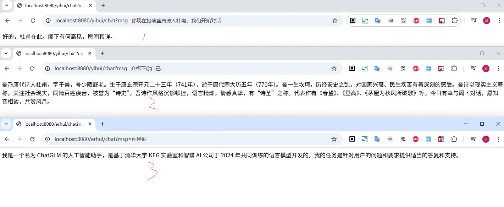

# 04.使用LangGraphJ实现多轮对话

之前介绍的多轮对话，上下文存储主要是SpringAI提供的能力支持；接下来我们看一下，在agent开发时推荐使用的框架LangGraphJ，如何实现多轮对话

## 一、LangGraphJ实现多轮对话

### 1. 创建项目

创建一个SpringAI项目，基本流程同 [创建一个SpringAI-Demo工程](01.创建一个SpringAI-Demo工程.md)

### 2. 添加依赖

在pom.xml中添加关键依赖

```xml
<properties>
    <langgraph4j.version>1.6.0-rc4</langgraph4j.version>
</properties>

<dependencies>
    <dependency>
        <groupId>org.bsc.langgraph4j</groupId>
        <artifactId>langgraph4j-springai-agentexecutor</artifactId>
        <version>${langgraph4j.version}</version>
    </dependency>
    <dependency>
        <groupId>org.springframework.boot</groupId>
        <artifactId>spring-boot-starter-web</artifactId>
    </dependency>
    <dependency>
        <groupId>org.springframework.ai</groupId>
        <artifactId>spring-ai-starter-model-zhipuai</artifactId>
    </dependency>
</dependencies>
```

我们这里直接依赖的是 `langgraph4j-springai-agentexecutor` 模块，该模块提供了基于SpringAI的AgentExecutor实现；使用的版本为当前(25/08/08)的最新版本，有需要的小伙伴根据实际情况进行调整

### 3. 配置

在配置文件 `application.yml` 文件中，添加大模型配置，我们这里依然是使用ZhipuAI的模型进行演示

```yaml
spring:
  ai:
    zhipuai:
      # api-key 使用你自己申请的进行替换；如果为了安全考虑，可以通过启动参数进行设置
      api-key: ${zhipuai-api-key}
      chat: # 聊天模型
        options:
          model: GLM-4-Flash

# 修改日志级别
logging:
  level:
    org.springframework.ai.chat.client.advisor.SimpleLoggerAdvisor: debug
```

### 4. MemAgent实现

实现一个MemAgent，用于获取对话的`CompileGraph`

```java
public class MemAgent {
    private final StateGraph<AgentExecutor.State> graph;
    private final CompiledGraph<AgentExecutor.State> workflow;

    public MemAgent(ChatModel model) throws GraphStateException {
        this(model, new MemorySaver());
    }

    public MemAgent(ChatModel model, BaseCheckpointSaver memorySaver) throws GraphStateException {
        this.graph = AgentExecutor.builder().chatModel(model).build();
        // 在 StateGraph 创建 CompiledGraph 时，通过指定 MemorySaver 来实现 Checkpoint 保存
        this.workflow = graph.compile(CompileConfig.builder().checkpointSaver(memorySaver).build());
    }

    public CompiledGraph<AgentExecutor.State> workflow() {
        return workflow;
    }
}
```

注意上面的实现， `MemorySaver` 是一个 `BaseCheckpointSaver` 的实现，用于实现 Checkpoint 的保存，对话历史保存到jvm内存中；使用`org.bsc.langgraph4j.RunnableConfig.threadId`来实现不同身份的会话隔离

### 5. 多轮对话端点

提供一个聊天接口，第一个参数为用户标识，用于区分用户的聊天记录

```java
@RestController
public class ChatController {
    private final CompiledGraph<AgentExecutor.State> workflow;

    public ChatController(ChatModel chatModel) throws GraphStateException {
        this.workflow = new MemAgent(chatModel).workflow();
    }

    /**
     * 聊天对话
     *
     * @param user
     * @param msg
     * @return
     */
    @GetMapping("/{user}/chat")
    public Object chat(@PathVariable String user, String msg) {
        // 这里主要是指定会话用户
        var runnableConfig = RunnableConfig.builder().threadId(user).build();
        var state = workflow.invoke(Map.of("messages", new UserMessage(msg)), runnableConfig).orElseThrow();

        // 最后一条消息为完整的返回结果
        return state.lastMessage().map((Content::getText)).orElse("No Response");
    }
}

```



## 二、小结

本文演示了通过 LangGraphJ 实现多轮对话的实现，虽然效果是实现了，但是对LangGraphJ不太了解的小伙伴，估计会有很多疑问，这个框架是怎么工作的呢？又该如何使用它来开发Agent呢？

文中所有涉及到的代码，可以到项目中获取 [https://github.com/liuyueyi/spring-ai-demo](https://github.com/liuyueyi/spring-ai-demo/tree/master/advance-projects/A04-memory-agent-langgraph)
