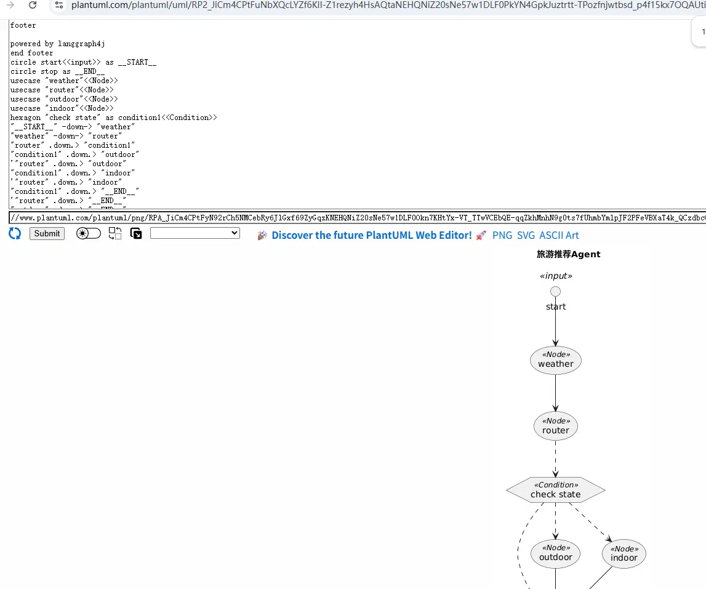
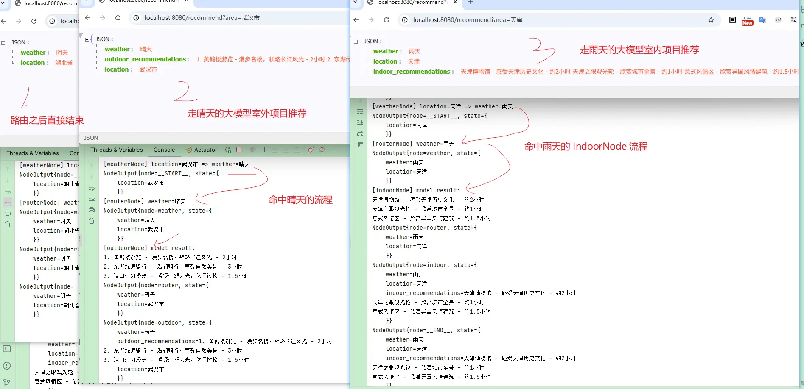

# 05.使用LangGraph4J实现Agent路由选择

在 [创建一个Langgraph4j示例工程](./14.创建一个Langgraph4j示例工程.md) 这一篇文章中，我们介绍了如何创建一个 LangGraph4j 的示例工程；

在上文中介绍到 `LangGraph4j` 时，就提到了它有一个重要的特性，就是可以定义循环图，使不同的组件（代理、工具或自定义逻辑）能够以有状态的方式进行交互

接下来我们来实际感受一下，上面这个重要的特性是如何表现的

## 一、项目创建

### 1. 创建LangGraph4j + SpringAI项目

具体的创建过程，与上文一致，有兴趣的小伙伴请关注 [创建一个Langgraph4j示例工程](./14.创建一个Langgraph4j示例工程.md)

### 2. 配置大模型密钥

这里依然使用智谱的免费大模型，使用其他的模型时，请自行替换`start`和下面的配置

```yaml
spring:
  ai:
    zhipuai:
      # api-key 使用你自己申请的进行替换；如果为了安全考虑，可以通过启动参数进行设置
      api-key: ${zhipuai-api-key}
      chat: # 聊天模型
        options:
          model: GLM-4-Flash
```

## 二、创建一个地点的旅游推荐Agent

### 1. 工作流程

在这里，我们设计一个简单的业务流程，开发一个旅游推荐的Agent，在这个agent中，我们需要结合旅游地点的天气，来选择不同的推荐项目


注意上面这个流程图，虽然它是事后由`LangGraph4j`生成的，实际也是呈现我们的旅游推荐Agent的核心工作流程

1. Weather: 根据传入的地方，获取当前的天气
2. Router: 作为一个路由节点（实际上啥也没干）
   - 当天气为晴天时，路由到 outdoor，推荐一些室外的旅游项目
   - 当天气为雨天时，路由到 indoor，推荐一些室内的旅游项目
   - 当天气为其他情况时，路由到 default，直接结束

### 2. 基本概念科普

在`LangGraph`中，有几个核心的概念，我们现简单来看一下；后面的实现中，会针对性的实现这些

> 以下内容，来自于: [langgraph4j](https://github.com/langgraph4j/langgraph4j)

#### AgentState

AgentState（或其扩展类）表示图的共享状态。它本质上是一个映射 (`Map<String, Object>`)，会在各个节点之间传递。每个节点都可以读取此状态并返回更新。

- `Schema`：状态的结构由“Schema”定义，它是一个 `Map<String, Channel.Reducer>` 类型的对象。Map 中的每个键都对应状态中的一个属性。
- `Channel.Reducer`：Reducer 定义了如何处理状态属性的更新。例如，新值可能会覆盖旧值，或者添加到现有值列表中。
- `Channel.Default<T>`：如果状态属性尚未设置，则为其提供默认值。
- `Channel.Appender<T>` `/` `MessageChannel.Appender<M>`：一种常见的 Reducer 类型，它将新值附加到与状态属性关联的列表中。这对于累积消息、工具调用或其他数据序列非常有用。MessageChannel.Appender 专为聊天消息而设计，还可以处理通过 ID 删除消息的操作。

#### Nodes

节点是构成图的执行操作的基石。节点通常是一个函数（或一个实现 `NodeAction<S>` 或 `AsyncNodeAction<S>` 的类），它：

- 接收当前 `AgentState` 作为输入。
- 执行某些计算（例如，调用 LLM、执行工具、运行自定义业务逻辑）。
- 返回一个表示状态更新的 `Map<String, Object>` 对象。这些更新随后会根据架构的 `Reducer` 应用于 `AgentState`。

节点可以是同步的，也可以是异步的（CompletableFuture）。

#### Edges

边定义节点之间的控制流。

- 普通边：从一个节点到另一个节点的无条件转换。节点 A 完成后，控制权始终传递给节点 B。您可以使用 `addEdge(sourceNodeName, destinationNodeName)` 定义普通边。
- 条件边：下一个节点根据当前 `AgentState` 动态确定。
  - 源节点完成后，将执行 `EdgeAction<S>`（或 `AsyncEdgeAction<S>`）函数。
  - 该函数接收当前状态并返回下一个要执行的节点的名称。
  - 这允许分支逻辑（例如，如果代理决定使用某个工具，则转到`execute_tool`节点；否则，转到`respond_to_user`节点）。
  - 条件边使用 `addConditionalEdges(...)` 定义。
- 入口点：您还可以使用 `addConditionalEntryPoint(...)` 为图定义条件入口点。

#### Compilation

在 `StateGraph` 中定义好所有节点和边后，可以使用 `compile()` 将其编译为 `CompiledGraph<S extends AgentState>`。

这个编译后的图是你的逻辑的不可变且可运行的表示。编译过程会验证图的结构（例如，检查是否存在孤立节点）。


#### Checkpoints (Persistence)

`LangGraph4j` 允许您在任何步骤保存（检查点）图的状态。这在以下情况下非常有用：

- 调试：检查各个点的状态以了解发生了什么。
- 恢复：将图恢复到之前的状态并继续执行。
- 长时间运行的进程：持久化长时间运行的代理交互的状态。您通常会使用 `CheckpointSaver` 实现（例如，使用 `MemorySaver` 进行内存存储，或者您也可以自己实现持久化存储）。

### 3. Node实现

从上面的流程图中我们也可以看出，这里定义了四个`Node`，接下来我们分别给于实现

**WeatherNode：用于获取地区的天气**

```java
 // Node1: weather agent - 这里示例使用简单规则模拟天气（生产可以换成真实天气 API）
NodeAction<AgentState> weatherNode = state -> {
    // 取入参 location（状态里可能已有）
    String loc = (String) state.value("location").orElseGet(() -> location);
    // 简单随机/固定返回以示范。生产请替换为天气 API 的结果（"晴天"/"雨天"/"阴天" 等）
    // 这里为了 demo，按 location 最后一个字判断（仅示例）
    String weather;
    if (loc.endsWith("市") || loc.endsWith("区")) weather = "晴天";
    else if (loc.endsWith("省")) weather = "阴天";
    else weather = "雨天";

    System.out.println("[weatherNode] location=" + loc + " => weather=" + weather);
    return Map.of(
            "location", loc,
            "weather", weather
    );
};
```

**RouterNode: 路由节点**

这个路由节点实际上啥也没干，不要也行，这里主要是用它打印了一下 WeatherNode 的输出

```java
// Node2: router - 只是做路由，本节点不做state的任何变更
NodeAction<AgentState> routerNode = state -> {
    // 这个节点，用于模拟啥也不干的场景
    String w = (String) state.value("weather").get();
    System.out.println("[routerNode] weather=" + w);
    return Map.of(); // 不改变状态
};
```

**OutdoorNode: 室外推荐节点**

在这个节点中，我们使用大模型来推荐外出旅游的项目

```java
// Node3: outdoor - 用大模型生成外出推荐
NodeAction<AgentState> outdoorNode = state -> {
    String loc = (String) state.value("location").orElseGet(() -> location);
    String weather = (String) state.value("weather").orElseGet(() -> "晴天");

    String prompt = String.format(
            "你是一个资深旅行推荐师：用户在地点“%s”，当前天气“%s”。请用中文给出 3 个适合外出（户外）游玩的项目，每个项目写一行：项目名称 - 30 字以内简短描述 - 预计耗时。不要写多余开头语，返回纯文本列表。",
            loc, weather);

    String rec = chatClient.prompt()
            .user(prompt)
            .call()
            .content();

    System.out.println("[outdoorNode] model result:\n" + rec);
    return Map.of("outdoor_recommendations", rec);
};
```

**IndoorNode: 室内推荐节点**

在这个节点中，我们使用大模型来推荐适合室内游玩的项目

```java
// Node4: indoor - 用大模型生成室内推荐
NodeAction<AgentState> indoorNode = state -> {
    String loc = (String) state.value("location").orElseGet(() -> location);
    String weather = (String) state.value("weather").orElseGet(() -> "雨天");

    String prompt = String.format(
            "你是一个资深旅行推荐师：用户在地点“%s”，当前天气“%s”。请用中文给出 3 个适合室内游玩的项目，每个项目写一行：项目名称 - 30 字以内简短描述 - 预计耗时。不要写多余开头语，返回纯文本列表。",
            loc, weather);

    String rec = chatClient.prompt()
            .user(prompt)
            .call()
            .content();

    System.out.println("[indoorNode] model result:\n" + rec);
    return Map.of("indoor_recommendations", rec);
};
```

到这里，我们的四个节点已经定义完成，接下来进行节点的连接

### 4. 节点连接

节点连接，就是将节点通过`addEdge`方法进行连接，这里我们连接了四个节点，并且定义了条件边，用于判断当前节点是否需要执行

首先实现路由的条件边判定

```java
public static class RouteEvaluationResult implements AsyncEdgeAction<AgentState> {
    @Override
    public CompletableFuture<String> apply(AgentState agentState) {
        // 根据天气来判断下一个节点
        String w = (String) agentState.value("weather").orElseGet(() -> "晴天");
        String res;
        if ("晴天".equalsIgnoreCase(w)) {
            res = "outdoor";
        } else if ("雨天".equalsIgnoreCase(w)) {
            res = "indoor";
        } else {
            // 其余天气直接结束
            res = END;
        }
        return CompletableFuture.completedFuture(res);
    }
}
```

然后是完成完整的节点、边定义

```java
// Build StateGraph
var graph = new StateGraph<>(AgentState::new)
        .addNode("weather", AsyncNodeAction.node_async(weatherNode))
        .addNode("router", AsyncNodeAction.node_async(routerNode))
        .addNode("outdoor", AsyncNodeAction.node_async(outdoorNode))
        .addNode("indoor", AsyncNodeAction.node_async(indoorNode))

        // entry
        .addEdge(START, "weather")
        // weather -> router
        .addEdge("weather", "router")
        // router 根据 state 决定去哪里
        .addConditionalEdges("router", new RouteEvaluationResult(), EdgeMappings.builder()
                .to("outdoor", "outdoor")
                .to("indoor", "indoor")
                .toEND()
                .build())
        // 输出结束
        .addEdge("outdoor", END)
        .addEdge("indoor", END)
        .compile();
```

### 5. 输出PlantUML

在上面的节点定义完成后，我们可以通过`graph.getGraph()`方法，将节点定义转换为PlantUML格式，方便我们查看节点定义

```java
/**
 * 打印 plantUml 格式流程图
 *
 * @return
 */
public String printPlantUml() {
    GraphRepresentation representation = graph.getGraph(GraphRepresentation.Type.PLANTUML, "旅游推荐Agent", true);
    // 获取 PlantUML 文本
    System.out.println("=== PlantUML 图 ===");
    System.out.println(representation.content());
    System.out.println("------- UML图结束 ---------");
    return representation.content();
}
```

运行结果如下：

```text
@startuml ____Agent
skinparam usecaseFontSize 14
skinparam usecaseStereotypeFontSize 12
skinparam hexagonFontSize 14
skinparam hexagonStereotypeFontSize 12
title "旅游推荐Agent"
footer

powered by langgraph4j
end footer
circle start<<input>> as __START__
circle stop as __END__
usecase "weather"<<Node>>
usecase "router"<<Node>>
usecase "outdoor"<<Node>>
usecase "indoor"<<Node>>
hexagon "check state" as condition1<<Condition>>
"__START__" -down-> "weather"
"weather" -down-> "router"
"router" .down.> "condition1"
"condition1" .down.> "outdoor"
'"router" .down.> "outdoor"
"condition1" .down.> "indoor"
'"router" .down.> "indoor"
"condition1" .down.> "__END__"
'"router" .down.> "__END__"
"outdoor" -down-> "__END__"
"indoor" -down-> "__END__"
@enduml
```

当我们拿到上面的内容之后，可以在 [在线plantuml工具](https://www.plantuml.com/plantuml/uml/SyfFKj2rKt3CoKnELR1Io4ZDoSa700001) 中查看，会生成对应的流程图



### 6. Agent封装

接下来就是将上面的实现，封装为一个完整的，对外直接使用的Agent，源码可以在最后的项目链接中获取，类名为 `WeatherRecommendAgent`

```java
public class WeatherRecommendAgent {
    private final ChatClient chatClient;
    private final CompiledGraph<AgentState> graph;

    public WeatherRecommendAgent(ChatClient chatClient) throws GraphStateException {
        this.chatClient = chatClient;
        this.graph = initGraph("北京");

        this.printPlantUml();
    }

    private CompiledGraph<AgentState> initGraph(String location) throws GraphStateException {
        // 这里实现节点定义
        // 节点链接
        // .... 省略上面的实现
        return graph;
    }

    /**
     * 通过给定的地方，返回旅游推荐项目
     *
     * @param location 地区
     * @return
     */
    public Map<String, Object> recommendByLocation(String location) {
        // 初始 state，用于上下文传参
        Map<String, Object> init = new HashMap<>();
        init.put("location", location);

        // 执行图
        AgentState last = null;
        for (var item : graph.stream(init)) {
            // 打印过程记录
            System.out.println(item);
            last = item.state();
        }
        // 返回最后的结果
        return last.data();
    }
}
```

### 7. 测试验证

接下来我们进行实例验证，创建一个Controller，调用`WeatherRecommendAgent`的`recommendByLocation`方法，传入地区参数，返回结果

```java
@RestController
public class ChatController {
    private final ChatClient chatClient;

    private final WeatherRecommendAgent weatherAgent;

    public ChatController(ChatModel chatModel) throws GraphStateException {
        chatClient = ChatClient.builder(chatModel)
                .defaultTools(new TimeWeatherTools())
                .build();

        weatherAgent = new WeatherRecommendAgent(chatClient);
    }

    @GetMapping("/recommend")
    public Object recommend(String area) {
        return weatherAgent.recommendByLocation(area);
    }
}
```



从上面实际的表现结果也可以看出和我们前面定义的流程图表现一致

## 三、小结

本文通过实现一个简单的基于地点的天气实现旅游项目推荐，演示了多个单Agent联合组装成一个更复杂、功能更强大Agent示例。

在这个实现过程中，我们实现或者应用了`LangGraph4j` 框架中定义的Node、边（条件边）、State等，通过这些来生成了一个 `CompiledGraph`， 通过`CompiledGraph`来实现多Agent的组合

虽然这个项目实现了一个多Agent的组合，但是善于思考的我们，依然会有一些疑问

- 这里使用的是默认的`AgentState`，内部是使用Map来传递共享参数，是否有更结构化的方式?
- `addConditionalEdges` 条件边定义的具体用法说明
- `GraphRepresentation` 节点定义的输出格式，是否可以自定义？ 是否可以结构化输出？
- 上面整体的实现更多的是借助`langgraph4j-core`，对于`langgraph4j-springai`是否会有更简单的使用姿势？

接下来我们将努力尝试对上面这些问题进行逐步回答，有兴趣的小伙伴可以持续关注一波

文中所有涉及到的代码，可以到项目中获取 [https://github.com/liuyueyi/spring-ai-demo](https://github.com/liuyueyi/spring-ai-demo/tree/master/advance-projects/A04-memory-agent-langgraph)
